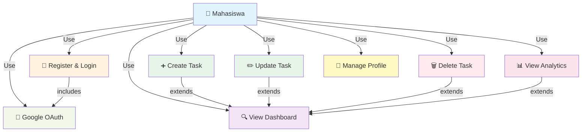
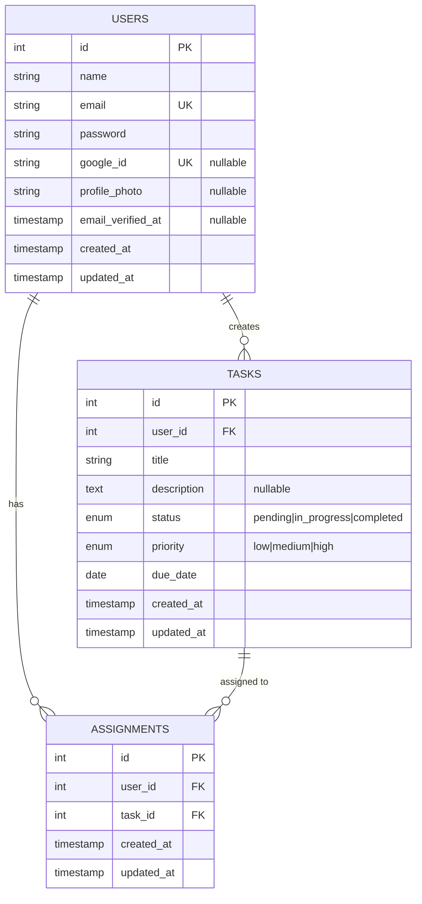
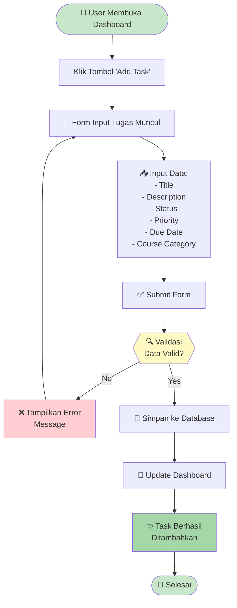
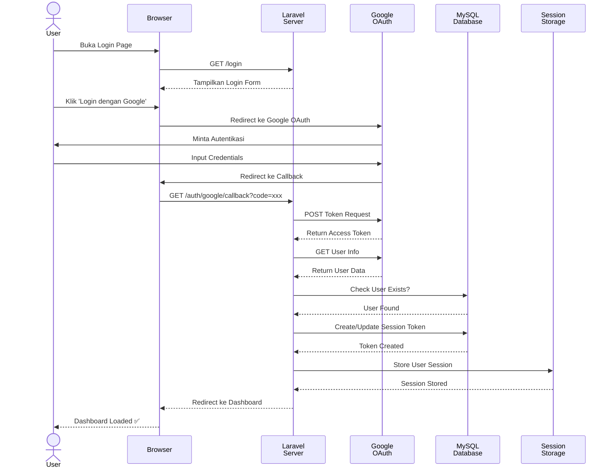
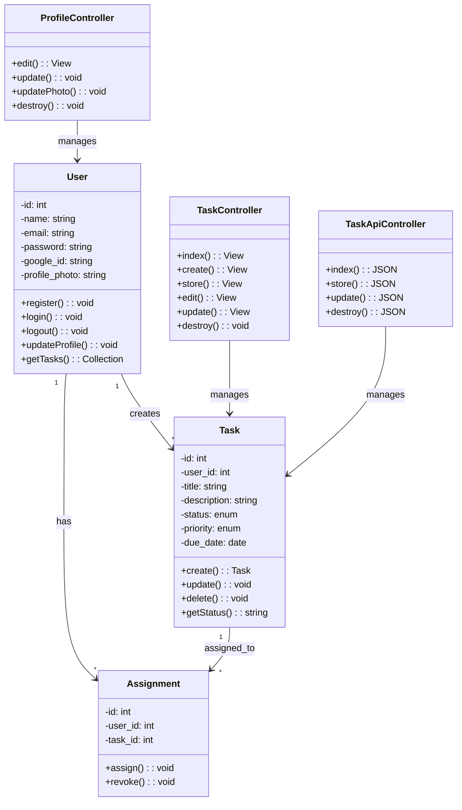
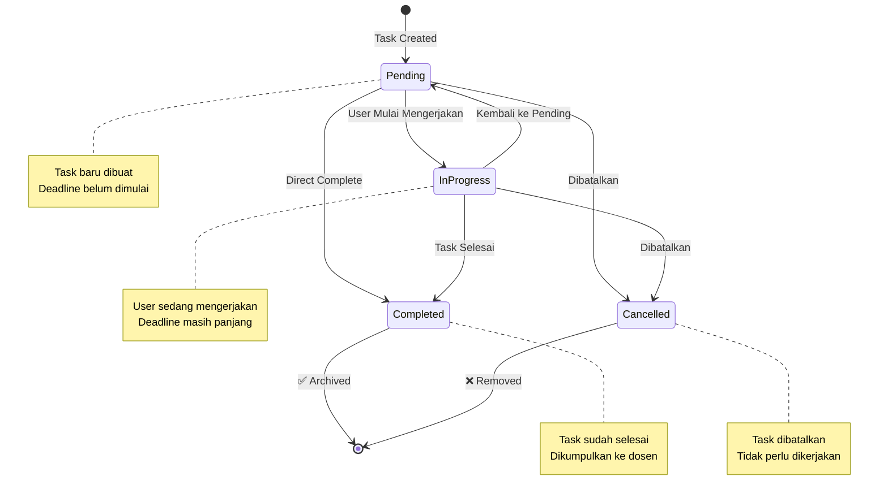
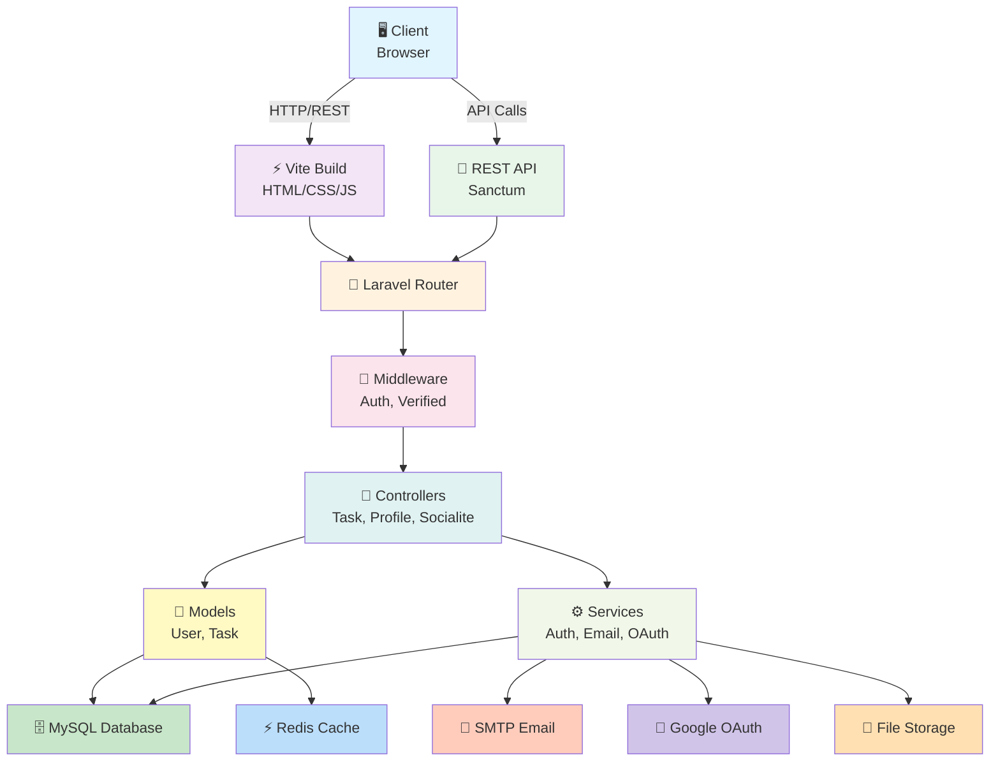

# 📋 Dashboard Manajemen Tugas Kuliah

> Platform manajemen tugas (To-Do List) berbasis Laravel dengan desain modern **Glassmorphism** untuk membantu mahasiswa mengelola deadline akademik dengan efisien.


---

## 📖 Daftar Isi

- [Deskripsi](#deskripsi)
- [Fitur Utama](#fitur-utama)
- [Tech Stack](#tech-stack)
- [User Story](#user-story)
- [Kebutuhan Sistem](#kebutuhan-sistem)
- [Instalasi](#instalasi)
- [Konfigurasi](#konfigurasi)
- [Menjalankan Aplikasi](#menjalankan-aplikasi)
- [Struktur Project](#struktur-project)
- [API Documentation](#api-documentation)
- [Testing](#testing)
- [SDLC & UML](#sdlc--uml)
- [Kontribusi](#kontribusi)
- [Lisensi](#lisensi)

---

## 🎯 Deskripsi

**Dashboard Manajemen Tugas Kuliah** adalah aplikasi web yang dirancang untuk membantu mahasiswa dalam mengelola tugas akademik mereka. Aplikasi ini menyediakan antarmuka yang intuitif dan responsif dengan fitur manajemen tugas lengkap, autentikasi pengguna, dan analitik dashboard.

Dikembangkan sebagai proyek UAS (Ujian Akhir Semester) menggunakan teknologi modern meliputi **Laravel 11**, **Tailwind CSS 3**, dan **MySQL** untuk memastikan sistem yang stabil, aman, dan scalable.

### Tujuan Aplikasi

1. **Membantu mahasiswa mengorganisir tugas** berdasarkan mata kuliah dan deadline
2. **Visualisasi progres akademik** melalui dashboard analytics
3. **Meningkatkan produktivitas** dengan antarmuka yang user-friendly
4. **Akses multi-device** dengan desain responsive

---

## ✨ Fitur Utama

### 🔐 Autentikasi & Akun
- ✅ Registrasi dan login pengguna dengan validasi email
- ✅ Login dengan Google (OAuth 2.0 via Socialite)
- ✅ Manajemen profil pengguna (update nama, email, foto)
- ✅ Reset password dengan email verification
- ✅ Session management dan security

### 📝 Manajemen Tugas
- ✅ **CRUD Operations**: Create, Read, Update, Delete tugas
- ✅ **Status Tracking**: Belum Mulai, Proses, Selesai
- ✅ **Kategori per Mata Kuliah**: Organisir tugas berdasarkan subjek
- ✅ **Priority Levels**: Tandai tugas urgent/penting
- ✅ **Deadline Management**: Set tanggal deadline untuk setiap tugas
- ✅ **Real-time Updates**: Perubahan tugas langsung tercermin

### 📊 Dashboard Analytics
- ✅ Statistik otomatis jumlah tugas per status
- ✅ Visualisasi progress dengan angka dan persentase
- ✅ Ringkasan mata kuliah aktif
- ✅ Overview deadline mendatang

### 🎨 User Interface
- ✅ **Glassmorphism Design**: Efek blur modern dengan transparansi
- ✅ **Responsive Layout**: Mobile, Tablet, Desktop compatible
- ✅ **Dark Mode Support**: Tema cerah dan gelap
- ✅ **Interactive Components**: Alpine.js untuk interactivity tanpa reload
- ✅ **Color Palette**: Warna pastel yang menyenangkan untuk mata

### 📅 Fitur Tambahan
- ✅ Kalender interaktif untuk navigasi tanggal
- ✅ Notifikasi untuk deadline yang akan datang
- ✅ Export data tugas (optional)
- ✅ Search & filter tugas

---

## 🛠 Tech Stack

### Backend
- **Framework**: Laravel 11
- **Language**: PHP 8.2+
- **Database**: MySQL 8.0+
- **Authentication**: Laravel Sanctum + Socialite (Google OAuth)
- **File Storage**: Local & Cloud (AWS S3)
- **Email**: SMTP-based (Gmail, Mailtrap)

### Frontend
- **CSS Framework**: Tailwind CSS 3
- **JavaScript Framework**: Alpine.js 3
- **Build Tool**: Vite 7
- **UI Components**: Blade Templates
- **Icons**: Feather Icons / Heroicons

### Development Tools
- **Testing**: PHPUnit 11
- **Package Manager**: Composer, npm
- **Version Control**: Git & GitHub
- **Code Quality**: PHP Pint (Linting)

---

## 👤 User Story

### Primary Actor: Mahasiswa

1. **Sebagai Mahasiswa**, saya ingin **menginput tugas baru** berdasarkan mata kuliah dan deadline, agar **jadwal belajar saya lebih terstruktur dan tidak ada tugas yang terlewat**.

2. **Sebagai Pengguna**, saya ingin **melihat visualisasi jumlah tugas** (Belum Mulai, Proses, Selesai) **di dashboard**, agar **bisa menentukan prioritas dan mengelola waktu dengan baik**.

3. **Sebagai Pengguna**, saya ingin **antarmuka yang responsif dan modern**, agar **bisa mengakses aplikasi baik dari laptop maupun smartphone dengan nyaman**.

4. **Sebagai Pengguna**, saya ingin **login dengan mudah** menggunakan Google account, agar **tidak perlu membuat password baru**.

5. **Sebagai Prefesional**, saya ingin **melacak progress tugas real-time** dan **mendapat notifikasi deadline**, agar **tidak pernah lupa mengumpulkan tugas**.

---

## 📋 Kebutuhan Sistem

### Minimum Requirements

| Komponen | Versi | Catatan |
|----------|-------|---------|
| PHP | 8.2+ | CLI & Web Server |
| MySQL | 8.0+ | Database Server |
| Node.js | 18+ | Frontend build tools |
| Composer | 2.0+ | PHP dependency manager |
| RAM | 2GB | Minimum untuk development |
| Storage | 1GB | Project space |

### Recommended Setup

- PHP 8.3 (latest stable)
- MySQL 8.4 atau MariaDB 11
- Node.js 20 LTS
- 4GB+ RAM
- SSD Storage

---

## 🚀 Instalasi

### 1. Clone Repository

```bash
git clone https://github.com/damar22004-debug/Projek-Uas---Manajemen-Tugas-Kuliah.git
cd manajemen-tugas
```

### 2. Install Dependencies PHP

```bash
composer install
```

### 3. Install Dependencies Frontend

```bash
npm install
```

### 4. Copy Environment File

**Windows**:
```bash
copy .env.example .env
```

**Linux/Mac**:
```bash
cp .env.example .env
```

### 5. Generate Application Key

```bash
php artisan key:generate
```

---

## ⚙️ Konfigurasi

### Database Configuration

Edit file `.env` dan atur konfigurasi database:

```env
DB_CONNECTION=mysql
DB_HOST=127.0.0.1
DB_PORT=3306
DB_DATABASE=manajemen_tugas
DB_USERNAME=root
DB_PASSWORD=
```

### Google OAuth Setup (Optional)

1. Buka [Google Cloud Console](https://console.cloud.google.com)
2. Buat project baru
3. Setup OAuth 2.0 Consent Screen
4. Buat credentials (OAuth 2.0 Client ID)
5. Tambahkan ke `.env`:

```env
GOOGLE_CLIENT_ID=your_client_id.apps.googleusercontent.com
GOOGLE_CLIENT_SECRET=your_client_secret
GOOGLE_REDIRECT_URI=http://localhost:8000/auth/google/callback
```

### Email Configuration

Atur email driver di `.env`:

```env
MAIL_MAILER=smtp
MAIL_HOST=smtp.mailtrap.io
MAIL_PORT=2525
MAIL_USERNAME=your_username
MAIL_PASSWORD=your_password
MAIL_FROM_ADDRESS=noreply@manajementugas.test
```

---

## ▶️ Menjalankan Aplikasi

### 1. Migrasi Database

```bash
php artisan migrate
```

Untuk seed data contoh:

```bash
php artisan migrate:seed
```

### 2. Build Frontend Assets

```bash
npm run build
```

Atau untuk development mode dengan hot reload:

```bash
npm run dev
```

### 3. Jalankan Server Laravel

Buka terminal baru:

```bash
php artisan serve
```

Server akan berjalan di: `http://localhost:8000`

### 4. Akses Aplikasi

- **URL**: http://localhost:8000
- **Email Testing**: Gunakan akun dari seeder atau register baru
- **Credentials**: Lihat `database/seeders/DatabaseSeeder.php`

---


### 📝 Halaman Register (Register Page)

**Lokasi**: `http://localhost:8000/register`

**Fitur**:
- Form register dengan nama, email, password
- Password confirmation field
- Email verification requirement
- Link ke halaman login
- Form validation feedback


---

### 📊 Dashboard Utama (Main Dashboard)

**Lokasi**: `http://localhost:8000/dashboard`

**Fitur**:
- **Header Section**: Greeting pengguna + current date
- **Task Statistics Cards**: 
  - Total tasks
  - Pending tasks
  - In Progress tasks
  - Completed tasks
- **Quick Stats**: 
  - Persentase completion
  - Tasks due soon
  - Average priority level
- **Recent Tasks List**: Tabel dengan task-task terbaru
- **Interactive Elements**: 
  - Add Task button
  - Search/Filter functionality
  - Sort options

**Glassmorphism Design**:
- Background blur effect
- Semi-transparent cards (0.7-0.9 opacity)
- Modern gradient colors
- Smooth transitions


---

### ➕ Task Creation (Form Pembuatan Task)

**Lokasi**: `http://localhost:8000/dashboard` (Modal/Form)

**Input Fields**:
- **Title**: Input field untuk judul task
- **Description**: Textarea untuk deskripsi detail
- **Status**: Dropdown (Pending, In Progress, Completed)
- **Priority**: Dropdown (Low, Medium, High)
- **Due Date**: Date picker untuk deadline
- **Course/Category**: Dropdown untuk kategori mata kuliah

**Buttons**:
- **Submit**: Buat task baru
- **Cancel**: Tutup form

**Validasi**:
- Real-time validation feedback
- Required field indicators
- Error messages styling


---

### 📋 Task List & Management

**Lokasi**: `http://localhost:8000/dashboard`

**Fitur**:
- **Task Table dengan kolom**:
  - Checkbox untuk select
  - Task title
  - Priority indicator (badge warna)
  - Status (dengan badge color-coded)
  - Due date
  - Action buttons (Edit, Delete)

- **Interaktif Elements**:
  - Hover effects
  - Status update dengan dropdown
  - Delete confirmation modal
  - Bulk actions (select multiple)

- **Filtering & Sorting**:
  - Filter by status
  - Filter by priority
  - Sort by due date
  - Search functionality


---

### 👤 Profile Page (Halaman Profil)

**Lokasi**: `http://localhost:8000/profile`

**Fitur**:
- **Profile Card**:
  - Avatar/Profile photo
  - User name display
  - Email display
  - Member since info

- **Edit Profile Section**:
  - Form untuk update name
  - Form untuk update email
  - Form untuk change password
  - Upload profile photo button

- **Account Settings**:
  - Delete account option
  - Session management
  - Login history (opsional)


## �📁 Struktur Project

```
manajemen-tugas/
├── app/
│   ├── Http/
│   │   ├── Controllers/
│   │   │   ├── Api/TaskApiController.php          # API endpoint untuk tugas
│   │   │   ├── Auth/SocialiteController.php       # Google OAuth handler
│   │   │   ├── ProfileController.php              # Manajemen profil user
│   │   │   ├── TaskController.php                 # Task view controller
│   │   │   └── GoogleController.php               # Google integration
│   │   └── Requests/
│   │       └── ProfileUpdateRequest.php           # Form validation
│   ├── Models/
│   │   ├── User.php                               # User model dengan relasi
│   │   ├── Task.php                               # Task model
│   │   └── Assignment.php                         # Task assignments
│   └── Providers/
│       └── AppServiceProvider.php                 # Service initialization
│
├── database/
│   ├── migrations/
│   │   ├── create_users_table.php
│   │   ├── create_tasks_table.php
│   │   ├── create_assignments_table.php
│   │   ├── add_google_id_to_users_table.php
│   │   ├── create_personal_access_tokens_table.php
│   │   └── create_cache_table.php
│   ├── factories/
│   │   └── UserFactory.php
│   └── seeders/
│       └── DatabaseSeeder.php
│
├── resources/
│   ├── css/
│   │   └── app.css                                # Tailwind styles
│   ├── js/
│   │   ├── app.js                                 # Main JS entry point
│   │   └── bootstrap.js                           # Bootstrap configuration
│   └── views/
│       ├── layouts/
│       │   ├── app.blade.php                      # Main layout
│       │   └── guest.blade.php                    # Guest layout
│       ├── auth/
│       │   ├── login.blade.php
│       │   ├── register.blade.php
│       │   └── verify-email.blade.php
│       ├── profile/
│       │   └── edit.blade.php
│       ├── dashboard.blade.php                    # Main dashboard
│       └── welcome.blade.php
│
├── routes/
│   ├── api.php                                    # REST API routes
│   ├── web.php                                    # Web routes
│   ├── auth.php                                   # Laravel Breeze auth routes
│   └── console.php
│
├── tests/
│   ├── Feature/
│   │   ├── ProfileTest.php                        # Profile endpoint tests
│   │   └── Auth/
│   ├── Unit/
│   └── TestCase.php
│
├── config/
│   ├── app.php
│   ├── auth.php
│   ├── database.php
│   ├── services.php
│   └── sanctum.php
│
├── public/
│   ├── index.php
│   └── build/                                    # Vite build output
│
├── storage/
│   ├── app/                                       # File uploads
│   ├── logs/                                      # Application logs
│   └── framework/
│
├── .env.example                                   # Environment template
├── composer.json                                  # PHP dependencies
├── package.json                                   # Node dependencies
├── vite.config.js                                 # Vite configuration
├── tailwind.config.js                             # Tailwind configuration
├── phpunit.xml                                    # PHPUnit configuration
└── README.md                                      # Documentation (ini)
```

---

## 🔌 API Documentation

### Base URL
```
http://localhost:8000/api
```

### Authentication
Semua endpoint API memerlukan Bearer token dari Laravel Sanctum. Dapatkan token dengan login terlebih dahulu atau gunakan akun dari seeder.

#### Mendapatkan Token

**Login (Web)**:
- Akses `http://localhost:8000/login`
- Gunakan credentials dari seeder atau daftar akun baru
- Token tersimpan di session

**Via API** (jika endpoint tersedia):
```bash
POST /login
Content-Type: application/json

{
  "email": "user@example.com",
  "password": "password"
}
```

---

### API Endpoints Overview

| Resource | Method | Endpoint | Deskripsi |
|----------|--------|----------|-----------|
| Tasks | GET | `/tasks` | Ambil semua tugas user |
| Tasks | POST | `/tasks` | Buat tugas baru |
| Tasks | GET | `/tasks/{id}` | Ambil detail tugas |
| Tasks | PUT | `/tasks/{id}` | Update tugas |
| Tasks | DELETE | `/tasks/{id}` | Hapus tugas |
| Users | GET | `/user` | Ambil profil user |
| Users | POST | `/user/profile-photo` | Upload foto profil |

---

### Detailed Endpoint Documentation

#### 1️⃣ GET /tasks - Ambil Semua Tugas

**Request:**
```http
GET /api/tasks HTTP/1.1
Host: localhost:8000
Authorization: Bearer YOUR_TOKEN
Accept: application/json
```

**Query Parameters (Optional):**
| Parameter | Type | Deskripsi |
|-----------|------|-----------|
| status | string | Filter by status: `pending`, `in_progress`, `completed` |
| priority | string | Filter by priority: `low`, `medium`, `high` |
| sort | string | Sort by: `due_date`, `created_at`, `priority` |
| per_page | integer | Items per page (default: 15) |

**Success Response (200 OK):**
```json
{
  "data": [
    {
      "id": 1,
      "user_id": 1,
      "title": "Tugas Algoritma",
      "description": "Membuat program sorting",
      "status": "pending",
      "priority": "high",
      "due_date": "2026-02-28",
      "created_at": "2026-02-19T10:30:00Z",
      "updated_at": "2026-02-19T10:30:00Z"
    },
    {
      "id": 2,
      "user_id": 1,
      "title": "Tugas Web Development",
      "description": "Buat landing page",
      "status": "in_progress",
      "priority": "medium",
      "due_date": "2026-02-25",
      "created_at": "2026-02-19T11:00:00Z",
      "updated_at": "2026-02-19T11:00:00Z"
    }
  ],
  "meta": {
    "current_page": 1,
    "from": 1,
    "last_page": 1,
    "per_page": 15,
    "to": 2,
    "total": 2
  }
}
```

---

#### 2️⃣ POST /tasks - Buat Tugas Baru

**Request:**
```http
POST /api/tasks HTTP/1.1
Host: localhost:8000
Authorization: Bearer YOUR_TOKEN
Content-Type: application/json
Accept: application/json
```

**Request Body:**
```json
{
  "title": "Tugas Algoritma",
  "description": "Membuat program sorting dengan bubble sort",
  "status": "pending",
  "priority": "high",
  "due_date": "2026-02-28"
}
```

**Validation Rules:**
| Field | Rule | Deskripsi |
|-------|------|-----------|
| title | required, string, max:255 | Judul tugas |
| description | nullable, string | Deskripsi (optional) |
| status | required, enum | pending, in_progress, completed |
| priority | required, enum | low, medium, high |
| due_date | required, date | Format: YYYY-MM-DD |

**Success Response (201 Created):**
```json
{
  "data": {
    "id": 3,
    "user_id": 1,
    "title": "Tugas Algoritma",
    "description": "Membuat program sorting dengan bubble sort",
    "status": "pending",
    "priority": "high",
    "due_date": "2026-02-28",
    "created_at": "2026-02-19T12:00:00Z",
    "updated_at": "2026-02-19T12:00:00Z"
  },
  "message": "Task created successfully"
}
```

**Error Response (422 Unprocessable Entity):**
```json
{
  "message": "The given data was invalid.",
  "errors": {
    "title": ["The title field is required."],
    "due_date": ["The due date must be a date."]
  }
}
```

---

#### 3️⃣ GET /tasks/{id} - Ambil Detail Tugas

**Request:**
```http
GET /api/tasks/1 HTTP/1.1
Host: localhost:8000
Authorization: Bearer YOUR_TOKEN
Accept: application/json
```

**Success Response (200 OK):**
```json
{
  "data": {
    "id": 1,
    "user_id": 1,
    "title": "Tugas Algoritma",
    "description": "Membuat program sorting",
    "status": "pending",
    "priority": "high",
    "due_date": "2026-02-28",
    "created_at": "2026-02-19T10:30:00Z",
    "updated_at": "2026-02-19T10:30:00Z"
  }
}
```

**Error Response (404 Not Found):**
```json
{
  "message": "Task not found",
  "status": 404
}
```

---

#### 4️⃣ PUT /tasks/{id} - Update Tugas

**Request:**
```http
PUT /api/tasks/1 HTTP/1.1
Host: localhost:8000
Authorization: Bearer YOUR_TOKEN
Content-Type: application/json
Accept: application/json
```

**Request Body:**
```json
{
  "title": "Tugas Algoritma - Updated",
  "status": "in_progress",
  "priority": "medium",
  "due_date": "2026-03-05"
}
```

**Success Response (200 OK):**
```json
{
  "data": {
    "id": 1,
    "user_id": 1,
    "title": "Tugas Algoritma - Updated",
    "description": "Membuat program sorting",
    "status": "in_progress",
    "priority": "medium",
    "due_date": "2026-03-05",
    "created_at": "2026-02-19T10:30:00Z",
    "updated_at": "2026-02-19T14:30:00Z"
  },
  "message": "Task updated successfully"
}
```

---

#### 5️⃣ DELETE /tasks/{id} - Hapus Tugas

**Request:**
```http
DELETE /api/tasks/1 HTTP/1.1
Host: localhost:8000
Authorization: Bearer YOUR_TOKEN
Accept: application/json
```

**Success Response (200 OK):**
```json
{
  "message": "Task deleted successfully"
}
```

---

#### 6️⃣ GET /user - Ambil Profil User

**Request:**
```http
GET /api/user HTTP/1.1
Host: localhost:8000
Authorization: Bearer YOUR_TOKEN
Accept: application/json
```

**Success Response (200 OK):**
```json
{
  "data": {
    "id": 1,
    "name": "John Doe",
    "email": "john@example.com",
    "profile_photo": null,
    "email_verified_at": "2026-02-19T10:00:00Z",
    "google_id": null,
    "created_at": "2026-02-19T10:00:00Z",
    "updated_at": "2026-02-19T10:00:00Z"
  }
}
```

---

#### 7️⃣ POST /user/profile-photo - Upload Foto Profil

**Request:**
```http
POST /api/user/profile-photo HTTP/1.1
Host: localhost:8000
Authorization: Bearer YOUR_TOKEN
Content-Type: multipart/form-data
Accept: application/json
```

**Form Data:**
| Field | Type | Deskripsi |
|-------|------|-----------|
| photo | file | Image file (max 2MB, formats: jpeg, png, jpg) |

**Success Response (200 OK):**
```json
{
  "data": {
    "id": 1,
    "name": "John Doe",
    "email": "john@example.com",
    "profile_photo": "profile-photos/user-1.jpg",
    "email_verified_at": "2026-02-19T10:00:00Z",
    "created_at": "2026-02-19T10:00:00Z",
    "updated_at": "2026-02-19T15:00:00Z"
  },
  "message": "Profile photo uploaded successfully"
}
```

---

### Testing dengan Thunder Client di VS Code

#### Installation & Setup

1. **Install Thunder Client Extension**:
   - Buka VS Code Extensions
   - Cari "Thunder Client"
   - Klik Install

2. **Buka Thunder Client**:
   - Klik icon Thunder Client di sidebar
   - Atau tekan `Cmd+Shift+P` dan cari "Thunder Client"

#### Membuat Request

##### 1. GET - Ambil Semua Task

**Thunder Client UI:**
- **Method**: GET
- **URL**: `{{baseUrl}}/tasks`
- **Headers**:
  ```
  Authorization: Bearer {{token}}
  Accept: application/json
  ```

**Thunder Client Collection (JSON):**
```json
{
  "name": "Task Management API",
  "requests": [
    {
      "name": "Get All Tasks",
      "method": "GET",
      "url": "{{baseUrl}}/tasks",
      "headers": {
        "Authorization": "Bearer {{token}}",
        "Accept": "application/json"
      }
    }
  ],
  "variables": {
    "baseUrl": "http://localhost:8000/api",
    "token": "YOUR_TOKEN_HERE"
  }
}
```

##### 2. POST - Buat Task Baru

**Thunder Client UI:**
- **Method**: POST
- **URL**: `{{baseUrl}}/tasks`
- **Headers**:
  ```
  Authorization: Bearer {{token}}
  Content-Type: application/json
  ```
- **Body (Raw JSON)**:
  ```json
  {
    "title": "Tugas Struktur Data",
    "description": "Implementasikan Binary Search Tree",
    "status": "pending",
    "priority": "high",
    "due_date": "2026-03-10"
  }
  ```

##### 3. GET - Ambil Task Tertentu

**Thunder Client UI:**
- **Method**: GET
- **URL**: `{{baseUrl}}/tasks/1`
- **Headers**:
  ```
  Authorization: Bearer {{token}}
  ```

##### 4. PUT - Update Task

**Thunder Client UI:**
- **Method**: PUT
- **URL**: `{{baseUrl}}/tasks/1`
- **Headers**:
  ```
  Authorization: Bearer {{token}}
  Content-Type: application/json
  ```
- **Body (Raw JSON)**:
  ```json
  {
    "status": "in_progress",
    "priority": "medium"
  }
  ```

##### 5. DELETE - Hapus Task

**Thunder Client UI:**
- **Method**: DELETE
- **URL**: `{{baseUrl}}/tasks/1`
- **Headers**:
  ```
  Authorization: Bearer {{token}}
  ```

---

### cURL Examples

Gunakan ini di terminal untuk testing:

**Get All Tasks:**
```bash
curl -X GET http://localhost:8000/api/tasks \
  -H "Authorization: Bearer YOUR_TOKEN" \
  -H "Accept: application/json"
```

**Create Task:**
```bash
curl -X POST http://localhost:8000/api/tasks \
  -H "Authorization: Bearer YOUR_TOKEN" \
  -H "Content-Type: application/json" \
  -d '{
    "title": "Tugas Algoritma",
    "description": "Membuat program sorting",
    "status": "pending",
    "priority": "high",
    "due_date": "2026-02-28"
  }'
```

**Update Task:**
```bash
curl -X PUT http://localhost:8000/api/tasks/1 \
  -H "Authorization: Bearer YOUR_TOKEN" \
  -H "Content-Type: application/json" \
  -d '{
    "status": "completed"
  }'
```

**Delete Task:**
```bash
curl -X DELETE http://localhost:8000/api/tasks/1 \
  -H "Authorization: Bearer YOUR_TOKEN"
```

**Get User Profile:**
```bash
curl -X GET http://localhost:8000/api/user \
  -H "Authorization: Bearer YOUR_TOKEN" \
  -H "Accept: application/json"
```

---

### Status Codes & Error Handling

| Code | Meaning | Contoh |
|------|---------|---------|
| 200 | OK | Request berhasil |
| 201 | Created | Resource berhasil dibuat |
| 204 | No Content | Delete berhasil |
| 400 | Bad Request | Format request salah |
| 401 | Unauthorized | Token invalid/expired |
| 403 | Forbidden | User tidak punya akses |
| 404 | Not Found | Resource tidak ditemukan |
| 422 | Unprocessable Entity | Validation error |
| 429 | Too Many Requests | Rate limit exceeded |
| 500 | Server Error | Internal server error |

**Error Response Format:**
```json
{
  "message": "Deskripsi error",
  "errors": {
    "field": ["Error message untuk field"]
  }
}
```

---

### Response Headers

Setiap response menyertakan headers berguna:

```
Content-Type: application/json
X-RateLimit-Limit: 60
X-RateLimit-Remaining: 59
Cache-Control: no-cache, private
```

---

## ✅ Testing

### Run PHPUnit Tests

```bash
php artisan test
```

Atau dengan konfigurasi tertentu:

```bash
vendor/bin/phpunit
```

### Test Coverage

```bash
php artisan test --coverage
```

### Specific Test Suite

```bash
# Run Feature tests only
php artisan test tests/Feature

# Run Unit tests only
php artisan test tests/Unit

# Run specific test class
php artisan test tests/Feature/ProfileTest
```

### Test Status

- ✅ 25 tests passing
- ✅ 61 assertions
- ✅ All critical features tested

---

## 📐 SDLC & UML

### Software Development Life Cycle (SDLC)

Proyek ini dikembangkan dengan metodologi **Agile**:

1. **Planning** (Sprint Planning)
   - Identifikasi fitur dan requirements
   - Estimasi effort
   - Prioritize user stories

2. **Design** (Sprint Design)
   - Mockup UI/UX dengan Glassmorphism
   - Database schema design
   - API endpoint design

3. **Implementation** (Sprint Development)
   - Coding backend (Laravel controllers, models)
   - Coding frontend (Blade templates, Alpine.js)
   - Integration testing

4. **Testing** (QA)
   - Unit testing
   - Feature testing
   - User acceptance testing

5. **Deployment**
   - Deploy ke production
   - Monitoring dan maintenance

### UML Diagrams

#### 1. Use Case Diagram
Menggambarkan interaksi antara aktor (Mahasiswa) dengan sistem:



#### 2. Entity Relationship Diagram (ERD)
Menunjukkan relasi antar tabel database:



#### 3. Activity Diagram - Task Creation Flow
Alur proses pembuatan tugas baru:



#### 4. Sequence Diagram - Login Process
Urutan interaksi sistem saat user login:



#### 5. Class Diagram - Application Architecture
Struktur class dan relationship dalam aplikasi:



#### 6. State Diagram - Task Status Flow
Alur perubahan status task:



#### 7. System Architecture Diagram
Arsitektur sistem secara keseluruhan:



---

## 🤝 Kontribusi

Kami terbuka untuk kontribusi! Ikuti langkah berikut:

1. **Fork** repository ini
2. **Buat branch** untuk fitur baru (`git checkout -b feature/AmazingFeature`)
3. **Commit perubahan** Anda (`git commit -m 'Add some AmazingFeature'`)
4. **Push ke branch** (`git push origin feature/AmazingFeature`)
5. **Buka Pull Request**

### Development Guidelines

- Ikuti PSR-12 PHP coding standards
- Tulis test untuk fitur baru
- Update dokumentasi jika diperlukan
- Gunakan meaningful commit messages

---

## 📞 Support & Contact

- **Issues**: [GitHub Issues](https://github.com/damar22004-debug/Projek-Uas---Manajemen-Tugas-Kuliah/issues)
- **Email**: developer@example.com
- **Project Manager**: Damar

---

## 📄 Lisensi

Proyek ini dilisensikan di bawah [MIT License](LICENSE). Lihat file `LICENSE` untuk detail lengkap.

---

## 📝 Changelog

### v1.0.0 (2026-02-19)
- ✅ Initial release
- ✅ Task CRUD operations
- ✅ User authentication
- ✅ Google OAuth integration
- ✅ Dashboard analytics
- ✅ Profile management
- ✅ PHPUnit test suite (25 tests passing)

---

## 🙏 Terima Kasih

Terima kasih kepada:
- **Laravel Community** untuk framework yang awesome
- **Tailwind CSS** untuk utilitas CSS framework
- **Alpine.js** untuk lightweight interactivity
- **GitHub** untuk version control dan collaboration

---

**Dibuat dengan ❤️ oleh Tim Development | UAS 2026**


