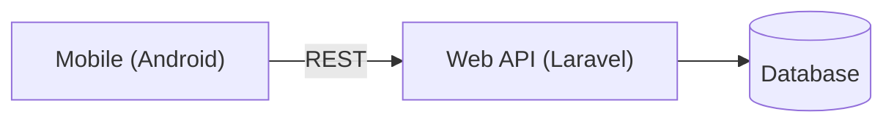

# Projek Manajemen Tugas Kuliah

Repository ini berisi dua modul utama:

- `web` — backend + frontend web (Laravel + Vite/Tailwind)
- `mobile` — aplikasi Android (Gradle, Java) untuk Mahasiswa mengelola tugas

Deskripsi singkat
- Tujuan: menyediakan sistem manajemen tugas kuliah dengan autentikasi, CRUD tugas, dan sinkronisasi antara mobile dan web lewat REST API.

Use Case
```mermaid
usecaseDiagram
actor "Mahasiswa" as Student
Student --> (Register)
Student --> (Login)
Student --> (Create Task)
Student --> (View Tasks)
Student --> (Update Task)
Student --> (Delete Task)
Student --> (Sync Tasks)
```

Arsitektur Ringkas


Panduan singkat
- Web: buka folder `web` → `composer install` → konfigurasi `.env` → `php artisan migrate --seed` → `npm install && npm run dev`.
- Mobile: buka folder `mobile` → pastikan Android SDK terpasang → jalankan emulator → `.\gradlew.bat installDebug`.

Lihat juga: [mobile/README.md](mobile/README.md)

Kontribusi
- Buat branch, lakukan perubahan, lalu buka PR ke `main`.


