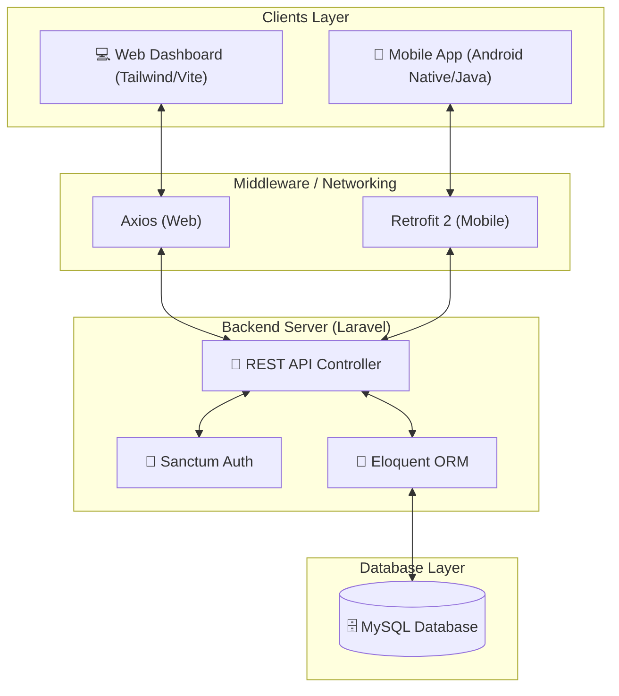
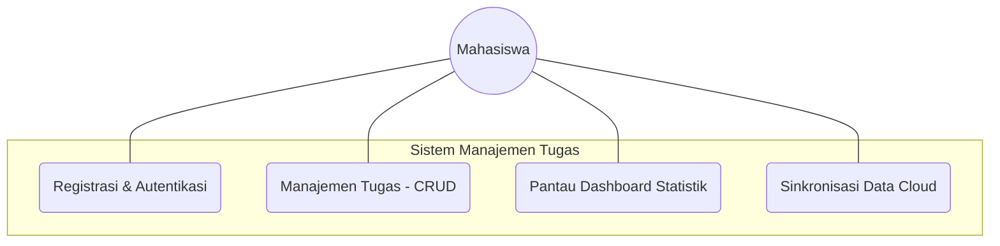
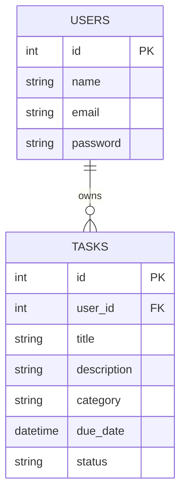
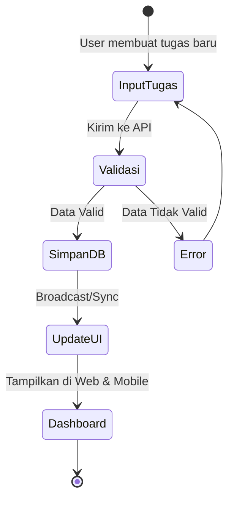
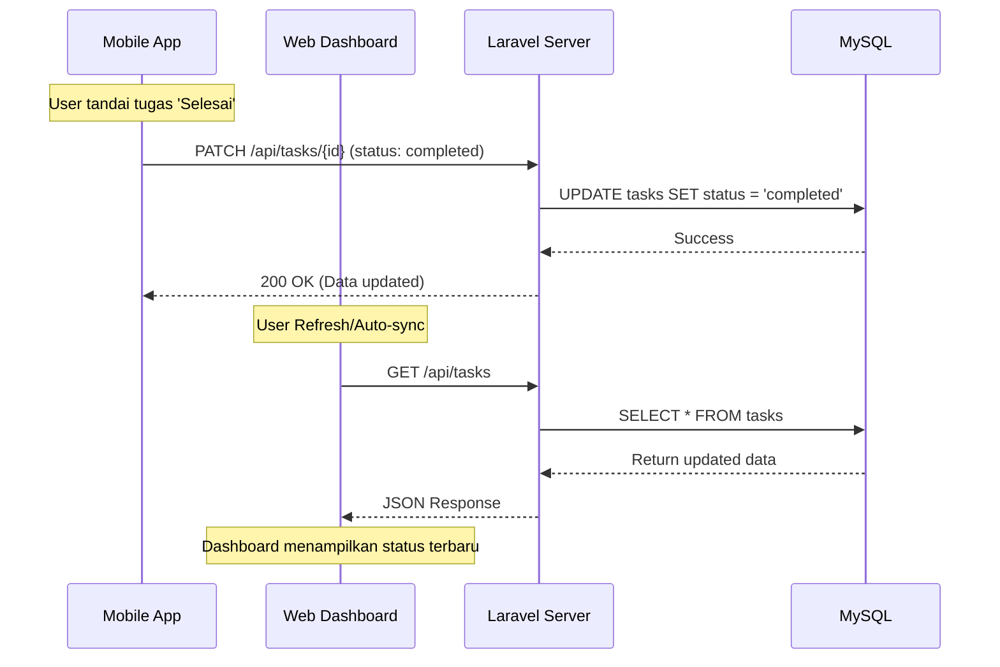
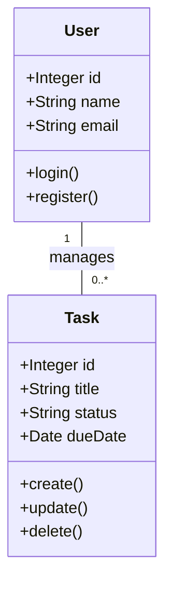
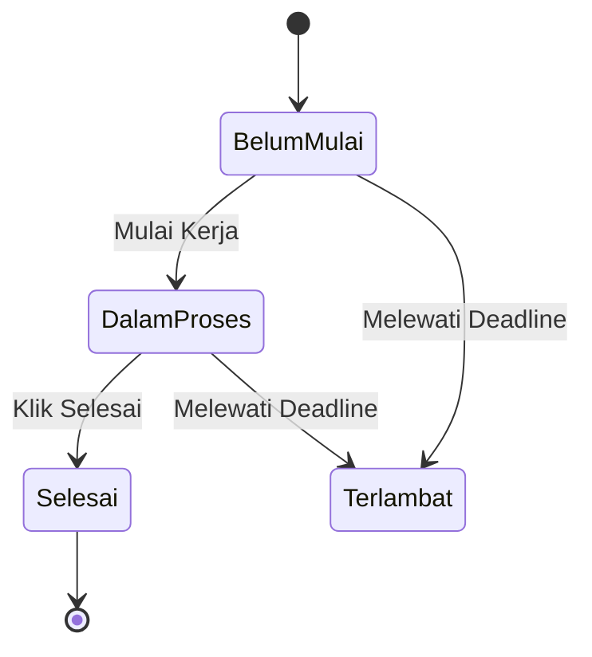

# 🎓 Sistem Manajemen Tugas Kuliah (Full-Stack)

Solusi manajemen tugas terintegrasi yang dirancang untuk membantu mahasiswa mengelola beban kuliah secara efisien melalui platform Web dan Mobile. Proyek ini menghubungkan backend API Laravel yang kuat dengan antarmuka pengguna Android Native dan Web yang modern.

---

## 🏗️ Arsitektur Sistem (System Architecture)
Sistem ini menggunakan arsitektur **Client-Server** terpusat di mana aplikasi Web dan Mobile berbagi sumber data yang sama melalui RESTful API.

---

## 🎯 Fitur Utama Keseluruhan
- **Autentikasi Terpusat**: Satu akun untuk akses di Web dan Mobile.
- **Dashboard Statistik**: Visualisasi jumlah tugas (Total, Selesai, Belum Mulai, Terlambat).
- **Manajemen Tugas (CRUD)**: Create, Read, Update, dan Delete tugas dengan mudah.
- **Sinkronisasi Real-time**: Perubahan di mobile langsung terlihat di web, dan sebaliknya.
- **UI/UX Konsisten**: Tema visual yang selaras antara platform web dan mobile (Modern & Clean).

---

## 📝 User Stories
Berikut adalah kebutuhan fungsional sistem dari perspektif pengguna (Mahasiswa):

| Sebagai... | Saya ingin... | Agar... |
| :--- | :--- | :--- |
| Mahasiswa | Mendaftar akun baru | Saya bisa menyimpan dan mengelola tugas pribadi saya. |
| Mahasiswa | Masuk (Login) ke Web dan Mobile dengan akun yang sama | Saya bisa mengakses data saya dari perangkat mana saja secara konsisten. |
| Mahasiswa | Menambahkan tugas baru (judul, deskripsi, tenggat waktu) | Saya tidak lupa dengan kewajiban kuliah saya. |
| Mahasiswa | Melihat ringkasan statistik tugas di dashboard | Saya bisa mengetahui progres belajar saya secara cepat. |
| Mahasiswa | Mengubah status tugas menjadi 'Selesai' | Saya tahu tugas mana yang sudah tuntas dikerjakan. |
| Mahasiswa | Menghapus tugas yang sudah tidak relevan | Daftar tugas saya tetap bersih dan terorganisir. |
| Mahasiswa | Mengedit detail tugas yang sudah ada | Saya bisa memperbarui informasi jika ada perubahan instruksi dari dosen. |

---

## 📊 UML Diagrams

### 1. Use Case Diagram
Menjelaskan interaksi aktor (Mahasiswa) dengan sistem secara keseluruhan baik melalui web maupun mobile.

### 2. Entity Relationship Diagram (ERD)
Struktur basis data terpusat yang melayani aplikasi Web dan Mobile.

### 3. Activity Diagram (Alur Kerja Manajemen Tugas)
Proses umum dari pembuatan tugas hingga sinkronisasi status.

### 4. Sequence Diagram (Sinkronisasi Multi-platform)
Bagaimana perubahan di satu platform (misal: Mobile) tercermin di platform lain (Web).

### 5. Class Diagram (Core System)
Struktur logika inti yang menghubungkan User dan Task.

### 6. State Diagram (Siklus Hidup Tugas)
Transisi status tugas yang berlaku di seluruh platform.

---

## 📂 Komponen Utama

### 1. [Web Dashboard & API](./web)
Backend utama yang dibangun menggunakan **Laravel 11**. Berfungsi sebagai *Single Source of Truth*.
- **Tech Stack**: PHP (Laravel), Tailwind CSS, Vite, MySQL.
- **Fitur**: UI Modern, REST API, Laravel Sanctum Auth.

### 2. [Mobile Application](./mobile)
Aplikasi Android native untuk aksesibilitas tinggi dan manajemen tugas *on-the-go*.
- **Tech Stack**: Java, Retrofit 2, Material 3 Design.
- **Style**: iOS-style Ultra Minimalist.

---

## 🚀 Panduan Instalasi Cepat

1. **Backend**: Masuk folder `web/`, jalankan `composer install`, `php artisan migrate`, dan `php artisan serve`.
2. **Mobile**: Buka folder `mobile/` di Android Studio, sesuaikan IP di `RetrofitClient.java`, lalu Build.

---
**Kontribusi**: Damar  
**Proyek**: UAS Manajemen Tugas Kuliah
