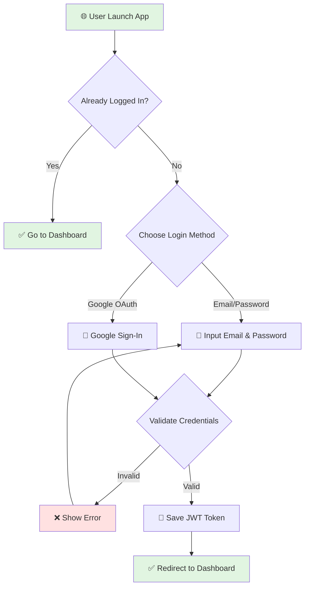
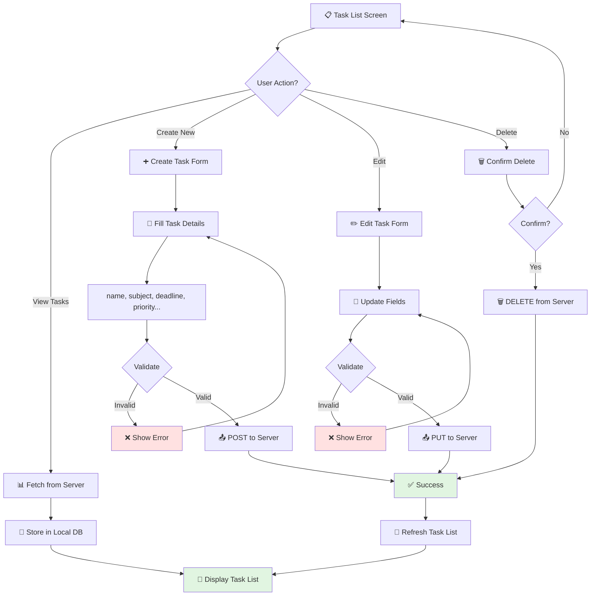
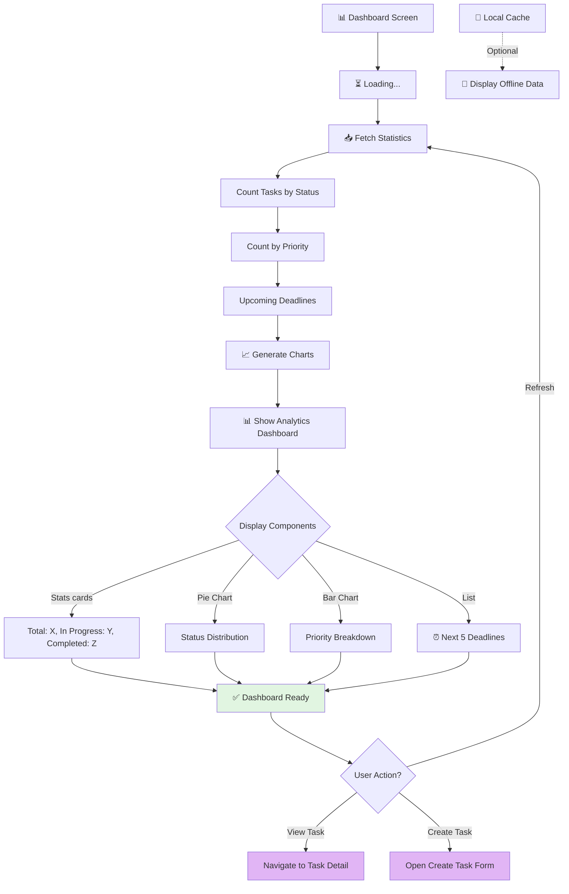
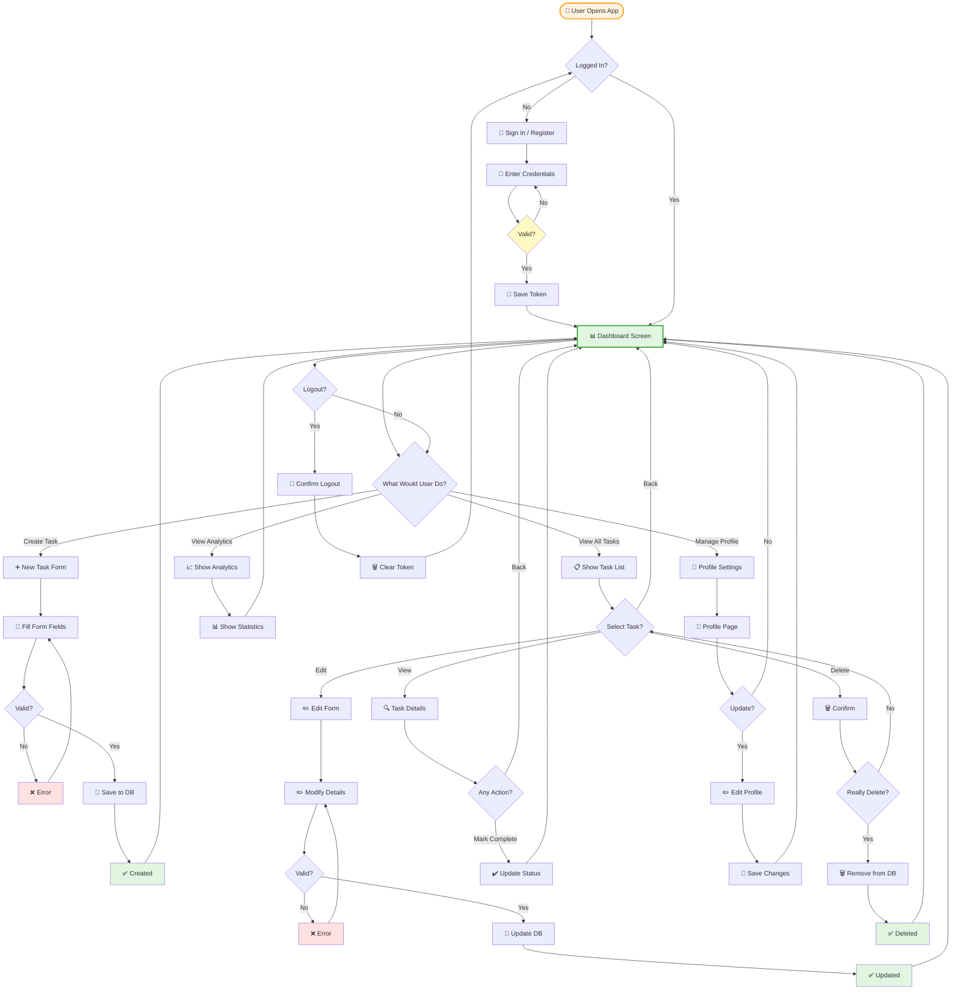
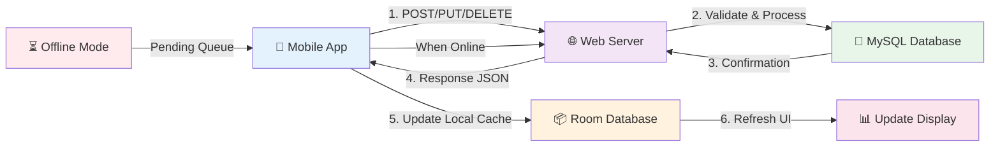

# 📱 Manajemen Tugas Kuliah - Multi-Platform App

> Aplikasi manajemen tugas akademik dengan dukungan **Web** dan **Mobile** (Android). Dirancang untuk membantu mahasiswa mengelola deadline dan prioritas tugas dengan efisien.


---

## 📋 Daftar Isi

- [Deskripsi](#deskripsi)
- [Fitur Utama](#fitur-utama)
- [User Flow & Flowcharts](#user-flow--flowcharts)
- [Arsitektur Sistem](#arsitektur-sistem)
- [Tech Stack](#tech-stack)
- [Struktur Project](#struktur-project)
- [Instalasi - Web](#instalasi---web)
- [Instalasi - Mobile](#instalasi---mobile)
- [Database Schema](#database-schema)
- [API Endpoints](#api-endpoints)
- [Kontribusi](#kontribusi)
- [Lisensi](#lisensi)

---

## 🎯 Deskripsi

**Manajemen Tugas Kuliah** adalah suite aplikasi multi-platform yang mengintegrasikan **Web Dashboard** dan **Mobile App** untuk manajemen tugas akademik yang komprehensif.

### Komponen Utama:
- **Web Version**: Dashboard berbasis Laravel dengan UI modern Glassmorphism
- **Mobile Version**: Aplikasi Android native untuk akses on-the-go

### Tujuan:
1. Membantu mahasiswa mengorganisir tugas berdasarkan mata kuliah
2. Memberikan visualisasi progres akademik real-time
3. Mengingatkan deadline tugas yang akan datang
4. Meningkatkan produktivitas dengan UX yang intuitif

---

## ✨ Fitur Utama

### 🔐 Autentikasi & Akun
- ✅ Registrasi dan Login dengan Email/Password
- ✅ Login dengan Google OAuth 2.0 (Web)
- ✅ Manajemen Profil Pengguna
- ✅ Password Recovery dengan Email Verification

### 📝 Manajemen Tugas
- ✅ CRUD Operations (Create, Read, Update, Delete)
- ✅ Status Tracking: Belum Mulai, Proses, Selesai
- ✅ Kategori per Mata Kuliah
- ✅ Priority Levels (Low, Medium, High, Urgent)
- ✅ Deadline Management
- ✅ Deskripsi & Catatan Tugas

### 📊 Analytics & Dashboard
- ✅ Statistik jumlah tugas per status
- ✅ Visualisasi progress dengan chart
- ✅ Ringkasan mata kuliah aktif
- ✅ Notification untuk deadline mendatang

### 🎨 User Interface
- ✅ Glassmorphism Design (Web)
- ✅ Responsive Layout (Mobile & Desktop)
- ✅ Dark Mode Support
- ✅ Material Design 3 (Mobile)

---

## 📊 User Flow & Flowcharts

### 1. Authentication Flow (Login/Register)



### 2. Task Management Flow



### 3. Dashboard & Analytics Flow



### 4. Complete User Journey (End-to-End)



### 5. Data Synchronization Flow (Web ↔ Mobile)



---

## 🏗️ Arsitektur Sistem

### Diagram Arsitektur Keseluruhan

```
┌─────────────────────────────────────────────────────────────┐
│                    MANAJEMEN TUGAS KULIAH                   │
├─────────────────────────────────────────────────────────────┤
│                       Frontend Layer                        │
│  ┌──────────────┐                          ┌──────────────┐ │
│  │  Web App     │                          │  Mobile App  │ │
│  │ (Blade +     │                          │  (Kotlin +   │ │
│  │  Tailwind)   │                          │  Jetpack)    │ │
│  └──────┬───────┘                          └──────┬───────┘ │
└─────────┼──────────────────────────────────────────┼─────────┘
          │                                          │
          │          HTTP/REST API                   │
          │         (Laravel Sanctum)                │
          │                                          │
┌─────────┴──────────────────────────────────────────┴─────────┐
│                    Backend Layer (Web)                       │
│              ┌─────────────────────────────────┐             │
│              │      Laravel 11 Framework       │             │
│              ├─────────────────────────────────┤             │
│              │  ✓ Routing & Controllers        │             │
│              │  ✓ Authentication (Sanctum)     │             │
│              │  ✓ Database ORM (Eloquent)      │             │
│              │  ✓ Validation & SQL Injection   │             │
│              │  ✓ Email Notifications          │             │
│              └─────────────────────────────────┘             │
└┬────────────────────────────────────────────────────────────┬┘
 │                                                            │
 │                   Data Persistence Layer                  │
 │                                                            │
┌┴────────────────────────────────────────────────────────────┴┐
│                  MySQL 8.0+ Database                         │
│  ┌───────────────────────────────────────────────────────┐  │
│  │  Tables:                                              │  │
│  │  • users (authentication & profiles)                  │  │
│  │  • tasks (task management)                            │  │
│  │  • assignments (task history)                         │  │
│  │  • personal_access_tokens (API tokens)                │  │
│  └───────────────────────────────────────────────────────┘  │
└────────────────────────────────────────────────────────────┘
```

### Flow Interaksi Data

```
┌─────────────┐
│   User      │
└──────┬──────┘
       │
       │ Opens App
       ▼
┌──────────────────┐
│  Login/Register  │
├──────────────────┤
│ Email + Password │
│   atau Google    │
└────────┬─────────┘
         │
         │ Success ✓
         ▼
┌────────────────────┐
│  Dashboard/Home    │
├────────────────────┤
│ Load User Tasks    │
│ Display Analytics  │
└────────┬───────────┘
         │
    ┌────┴────────────────┐
    │                     │
    ▼                     ▼
┌─────────────┐    ┌────────────────┐
│ Create Task │    │ View/Edit Task │
│ POST /tasks │    │ GET /tasks/:id │
└────┬────────┘    └────────┬───────┘
     │                      │
     │ Save to DB           │ Update DB
     ▼                      ▼
┌─────────────────────────────────┐
│     MySQL Database              │
│  (Persist Task Data)            │
└─────────────────────────────────┘
```

---

## 🛠 Tech Stack

### Teknologi Web Frontend
| Layer | Technology | Purpose |
|-------|-----------|---------|
| **UI Framework** | Blade Templates + Alpine.js | Server-side rendering & interactivity |
| **Styling** | Tailwind CSS 3 | Modern responsive CSS |
| **Build Tool** | Vite 7 | Fast bundling & development |
| **Icons** | Heroicons | UI Icon Library |

### Teknologi Web Backend
| Component | Technology | Purpose |
|-----------|-----------|---------|
| **Framework** | Laravel 11 | Web framework |
| **Language** | PHP 8.2+ | Server-side language |
| **REST API** | Laravel Sanctum | Token-based authentication |
| **Database** | MySQL 8.0+ | Data storage |
| **OAuth** | Socialite | Google login integration |
| **Testing** | PHPUnit 11 | Unit & Feature testing |

### Teknologi Mobile
| Component | Technology | Purpose |
|-----------|-----------|---------|
| **Language** | Kotlin | Android development |
| **SDK** | Android 15.0+ | Target API level |
| **UI Kit** | Jetpack Compose / Material Design 3 | Modern Android UI |
| **HTTP Client** | Retrofit + OkHttp | API communication |
| **Local DB** | Room Database | Offline data caching |
| **State Management** | ViewModel + LiveData | App state management |

---

## 📁 Struktur Project

```
manajemen-tugas/
├── web/                               # 🌐 Web Application (Laravel)
│   ├── app/
│   │   ├── Http/
│   │   │   ├── Controllers/           # Logika aplikasi
│   │   │   ├── Middleware/            # Request filtering
│   │   │   └── Requests/              # Form validation
│   │   ├── Models/
│   │   │   ├── User.php               # User model
│   │   │   ├── Task.php               # Task model
│   │   │   └── Assignment.php         # Assignment tracking
│   │   └── Providers/
│   ├── config/                        # Konfigurasi Laravel
│   ├── database/
│   │   ├── migrations/                # Database schema
│   │   ├── factories/                 # Data factory untuk testing
│   │   └── seeders/                   # Database seeding
│   ├── resources/
│   │   ├── views/                     # Blade templates
│   │   ├── css/                       # Tailwind CSS
│   │   └── js/                        # Frontend JavaScript
│   ├── routes/
│   │   ├── web.php                    # Web routes
│   │   └── api.php                    # API routes
│   ├── tests/                         # Test suites
│   ├── public/                        # Public assets
│   ├── storage/                       # File storage
│   ├── vendor/                        # Composer dependencies
│   ├── composer.json                  # PHP dependencies
│   ├── package.json                   # Node dependencies
│   ├── tailwind.config.js             # Tailwind config
│   ├── vite.config.js                 # Vite config
│   └── README.md                      # Web documentation
│
├── mobile/                            # 📱 Mobile App (Android/Kotlin)
│   ├── app/
│   │   ├── src/
│   │   │   ├── main/
│   │   │   │   ├── java/
│   │   │   │   │   └── com/manajementugas/mobile/
│   │   │   │   │       ├── ui/                # UI components & screens
│   │   │   │   │       ├── data/              # Data models & API
│   │   │   │   │       ├── viewmodel/         # ViewModel layer
│   │   │   │   │       └── MainActivity.kt    # Entry point
│   │   │   │   └── res/
│   │   │   │       ├── layout/                # XML layouts
│   │   │   │       ├── drawable/             # App drawables
│   │   │   │       └── values/                # Resources (strings, colors)
│   │   │   └── test/java/                     # Unit tests
│   │   └── build.gradle.kts              # Gradle build config
│   ├── gradle/                          # Gradle wrapper
│   ├── settings.gradle.kts              # Gradle settings
│   ├── build.gradle.kts                 # Project build config
│   └── README.md                        # Mobile documentation
│
├── README.md                          # 📖 Project Overview (this file)
├── .gitignore                         # Git ignore rules
└── .git/                              # Git repository

```

---

## 🔗 Database Schema

### Entity Relationship Diagram

```
┌──────────────────────────────────┐
│         USERS                    │
├──────────────────────────────────┤
│ • id (PK)                        │
│ • name                           │
│ • email (UNIQUE)                 │
│ • password (hashed)              │
│ • google_id (nullable)           │
│ • created_at                     │
│ • updated_at                     │
└────────────┬─────────────────────┘
             │
             │ 1:N relationship
             │
             ▼
┌──────────────────────────────────┐
│         TASKS                    │
├──────────────────────────────────┤
│ • id (PK)                        │
│ • user_id (FK)                   │
│ • name                           │
│ • subject                        │
│ • description                    │
│ • status (enum)                  │
│ • priority (enum)                │
│ • deadline (datetime)            │
│ • created_at                     │
│ • updated_at                     │
└──────────────────────────────────┘

┌──────────────────────────────────┐
│    ASSIGNMENTS (History)         │
├──────────────────────────────────┤
│ • id (PK)                        │
│ • user_id (FK)                   │
│ • task (json)                    │
│ • action                         │
│ • changes (json)                 │
│ • created_at                     │
└──────────────────────────────────┘

Status Options: "Belum Mulai", "Proses", "Selesai"
Priority Options: "Low", "Medium", "High", "Urgent"
```

---

## 🚀 Instalasi - Web

### Prerequisites
- PHP 8.2+
- MySQL 8.0+
- Node.js 18+
- Composer 2.0+

### Step 1: Clone & Setup Project

```bash
# Clone repository
git clone https://github.com/damar22004-debug/Projek-Uas---Manajemen-Tugas-Kuliah.git
cd manajemen-tugas/web

# Install dependencies
composer install
npm install
```

### Step 2: Konfigurasi Environment

```bash
# Copy .env file
cp .env.example .env

# Generate application key
php artisan key:generate
```

### Step 3: Database Setup

Edit `.env` untuk konfigurasi database:

```env
DB_CONNECTION=mysql
DB_HOST=127.0.0.1
DB_PORT=3306
DB_DATABASE=manajemen_tugas
DB_USERNAME=root
DB_PASSWORD=
```

Jalankan migrations:

```bash
php artisan migrate
php artisan db:seed
```

### Step 4: Build Frontend Assets

```bash
npm run build
# atau untuk development dengan hot reload:
npm run dev
```

### Step 5: Jalankan Server

```bash
php artisan serve
```

Server akan berjalan di: `http://localhost:8000`

---

## 📱 Instalasi - Mobile

### Prerequisites
- Android Studio (Flamingo atau lebih baru)
- Android SDK 31+
- Kotlin 1.9+
- JDK 17+

### Step 1: Clone & Setup

```bash
cd manajemen-tugas/mobile
```

### Step 2: Open in Android Studio

1. Buka **Android Studio**
2. Pilih **File > Open**
3. Navigate ke folder `manajemen-tugas/mobile`
4. Android Studio akan otomatis download dependencies

### Step 3: Configure API Endpoint

Edit `MainActivity.kt` atau config file:

```kotlin
val API_BASE_URL = "http://your-server-ip:8000/api"
```

### Step 4: Build & Run

```bash
# Via Android Studio:
# 1. Click "Run" button atau tekan Shift+F10

# Via Command Line:
./gradlew assembleDebug
./gradlew installDebug
```

---

## 🔌 API Endpoints

### Authentication
```
POST   /api/auth/register          - Register user
POST   /api/auth/login             - Login user
POST   /api/auth/logout            - Logout user
GET    /api/user                   - Get authenticated user
PUT    /api/user/profile           - Update user profile
POST   /api/auth/password/reset    - Reset password
```

### Tasks Management
```
GET    /api/tasks                  - Get all user tasks
POST   /api/tasks                  - Create new task
GET    /api/tasks/:id              - Get specific task
PUT    /api/tasks/:id              - Update task
DELETE /api/tasks/:id              - Delete task
GET    /api/tasks/status/:status   - Filter by status
```

### Analytics
```
GET    /api/analytics/dashboard    - Get dashboard statistics
GET    /api/analytics/monthly      - Monthly summary
GET    /api/analytics/subjects     - Summary per subject
```

---

## 📋 User Stories

### Web Platform
1. **Sebagai mahasiswa**, saya ingin **login dengan mudah**, agar **bisa langsung akses dashboard tanpa setup rumit**
2. **Sebagai pengguna**, saya ingin **CRUD tugas**, agar **bisa mengelola deadline dengan fleksibel**
3. **Sebagai pengguna**, saya ingin **melihat analytics**, agar **bisa track progress akademik saya**

### Mobile Platform
1. **Sebagai mahasiswa**, saya ingin **akses task list dari smartphone**, agar **bisa check tugas kapan saja**
2. **Sebagai pengguna**, saya ingin **notifikasi deadline**, agar **tidak ada tugas yang terlewat**
3. **Sebagai pengguna**, saya ingin **offline mode**, agar **tetap bisa lihat task tanpa internet**

---

## 🧪 Testing

### Web Testing

```bash
cd web

# Run all tests
php artisan test

# Run specific test
php artisan test tests/Feature/TaskTest.php

# Run with coverage
php artisan test --coverage
```

### Mobile Testing

```bash
cd mobile

# Run unit tests
./gradlew test

# Run instrumentation tests
./gradlew connectedAndroidTest
```

---

## 📊 Development Workflow

### Git Branch Strategy

```
main
  ↑
  ├── develop (integration branch)
  │    ↑
  │    ├── feature/user-auth
  │    ├── feature/task-management
  │    └── feature/analytics
  │
  └── hotfix/bug-fixes
```

### Contribution Guide

1. Fork repository
2. Create feature branch: `git checkout -b feature/your-feature`
3. Commit changes: `git commit -m "Add: your feature"`
4. Push to branch: `git push origin feature/your-feature`
5. Open Pull Request

---

## 🤝 Kontribusi

Kami sangat terbuka untuk kontribusi! Silakan:

1. **Fork** repository ini
2. **Create** feature branch
3. **Commit** changes dengan pesan yang jelas
4. **Push** ke branch Anda
5. **Open** Pull Request

### Guidelines
- Follow Laravel & Kotlin best practices
- Write meaningful commit messages
- Add tests untuk fitur baru
- Update documentation

---

## 📄 Lisensi

Project ini dilisensikan di bawah **MIT License**. Lihat file [LICENSE](LICENSE) untuk detail lengkap.

---

## 📞 Kontak & Support

- **Developer**: [damar22004-debug](https://github.com/damar22004-debug)
- **Repository**: [Projek-Uas---Manajemen-Tugas-Kuliah](https://github.com/damar22004-debug/Projek-Uas---Manajemen-Tugas-Kuliah)
- **Issues**: [GitHub Issues](https://github.com/damar22004-debug/Projek-Uas---Manajemen-Tugas-Kuliah/issues)

---

## 🎓 Project Info

- **Type**: UAS (Ujian Akhir Semester) Project
- **Created**: 2026
- **Status**: Active Development 🚀
- **Version**: 1.0.0

---

**Terakhir diupdate**: 23 Februari 2026

Dibuat dengan ❤️ untuk membantu mahasiswa Indonesia dalam mengelola tugas akademik.


