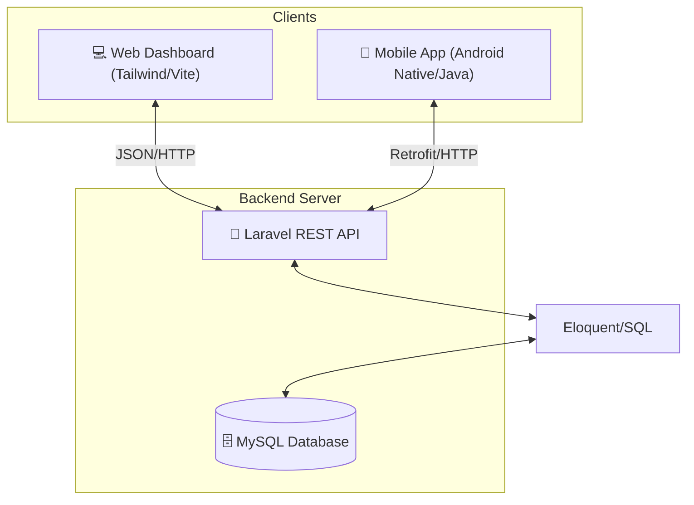
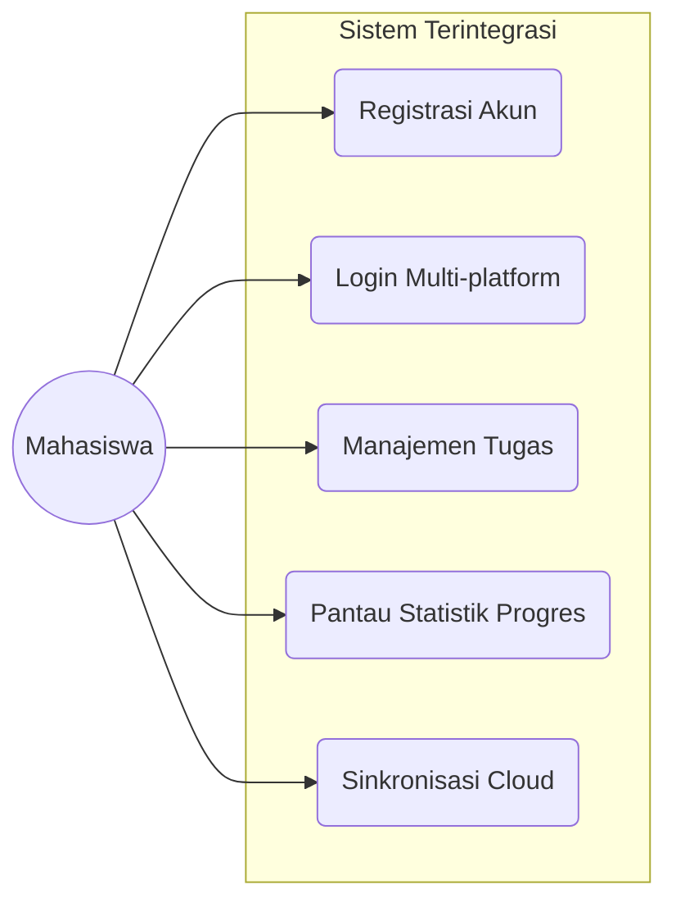
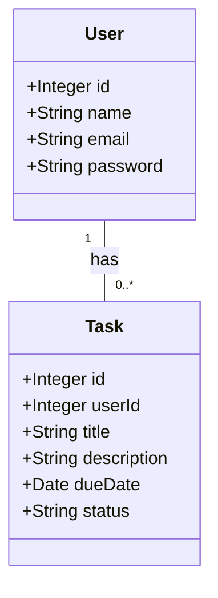
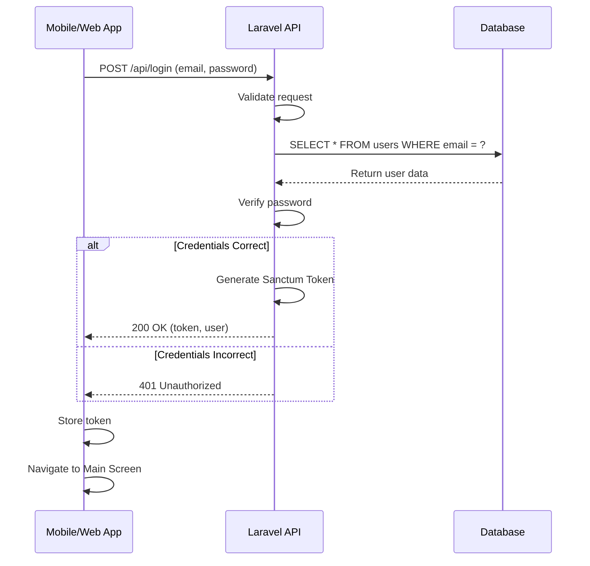

# 🎓 Sistem Manajemen Tugas Kuliah (Full-Stack)

Solusi manajemen tugas terintegrasi yang dirancang untuk membantu mahasiswa mengelola beban kuliah secara efisien melalui platform Web dan Mobile. Proyek ini menghubungkan backend API yang kuat dengan antarmuka pengguna yang modern dan responsif.

---

## 🏗️ Arsitektur Sistem
Sistem ini menggunakan arsitektur **Client-Server** di mana aplikasi Web dan Mobile berbagi sumber data yang sama melalui RESTful API.

---

## 📂 Komponen Proyek

### 1. [Web Dashboard & API](./web)
Backend utama yang dibangun menggunakan **Laravel**. Berfungsi sebagai penyedia API sekaligus dashboard administrasi web.
- **Tech Stack**: PHP (Laravel), Tailwind CSS, Vite, MySQL.
- **Fitur**: Manajemen user, dashboard statistik, REST API endpoints, autentikasi sanctum.

### 2. [Mobile Application](./mobile)
Aplikasi Android native yang dirancang untuk akses cepat saat bepergian.
- **Tech Stack**: Java, Retrofit 2, Material Design 3.
- **Fitur**: UI Modern (Glassmorphism), Sinkronisasi Real-time.

---

## 🎯 Fitur Utama Keseluruhan
- **Autentikasi Terpusat**: Satu akun untuk akses di Web dan Mobile.
- **Dashboard Statistik**: Visualisasi jumlah tugas (Total, Selesai, Belum Mulai, Terlambat).
- **Manajemen Tugas (CRUD)**: Create, Read, Update, dan Delete tugas dengan mudah.
- **Sinkronisasi Real-time**: Perubahan di mobile langsung terlihat di web, dan sebaliknya.
- **UI/UX Konsisten**: Tema visual yang selaras antara platform web dan mobile (Modern & Clean).

---

## 📊 Use Case Diagram

---

##  UML Diagrams
Untuk memberikan gambaran yang lebih teknis, berikut adalah beberapa diagram UML yang merepresentasikan struktur dan alur sistem.

### 1. Class Diagram
Diagram ini menunjukkan entitas utama dalam sistem (`User` dan `Task`) beserta atribut dan relasinya.

### 2. Sequence Diagram (Proses Login)
Diagram ini menjelaskan langkah-langkah yang terjadi saat pengguna melakukan login, mulai dari client hingga database.

---

## 🚀 Panduan Memulai Cepat

### Setup Backend (Web)
1. Masuk ke folder `web/`.
2. Jalankan `composer install` & `npm install`.
3. Salin `.env.example` ke `.env` dan atur database.
4. Jalankan migrasi: `php artisan migrate`.
5. Jalankan server: `php artisan serve`.

### Setup Mobile (Android)
1. Buka folder `mobile/` menggunakan **Android Studio**.
2. Sesuaikan `BASE_URL` di `RetrofitClient.java` dengan IP server Laravel Anda.
3. Build dan jalankan aplikasi di Emulator atau Perangkat Fisik.

---
**Kontribusi**: Silakan ajukan *Pull Request* atau laporkan *Issues* jika menemukan kendala.
