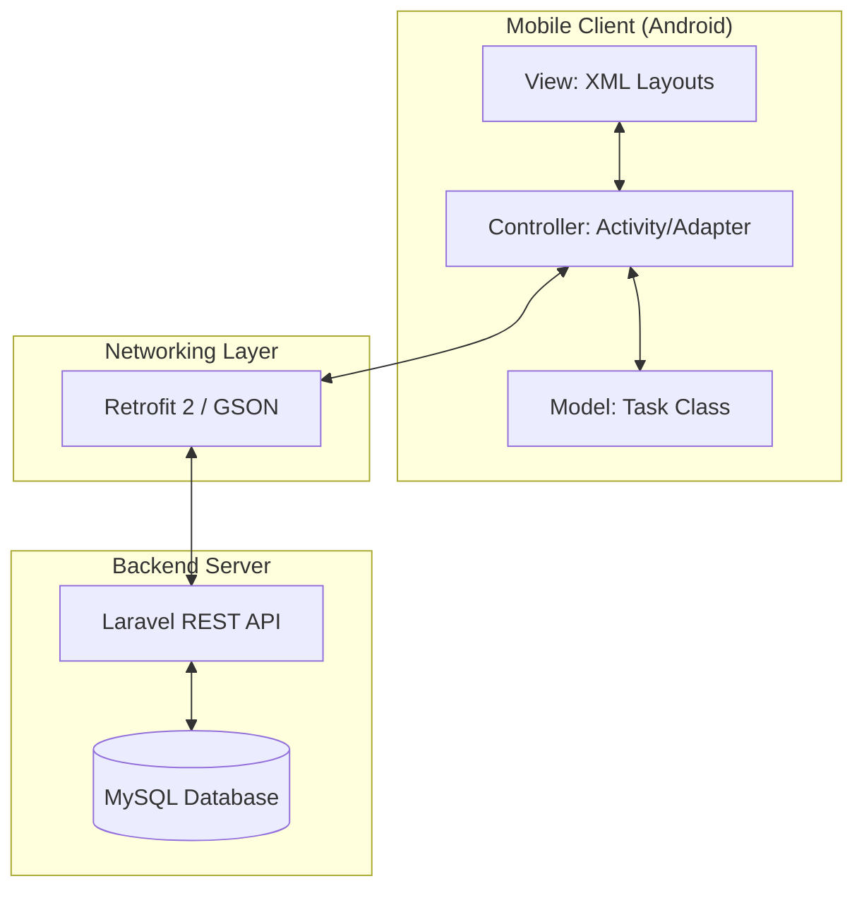
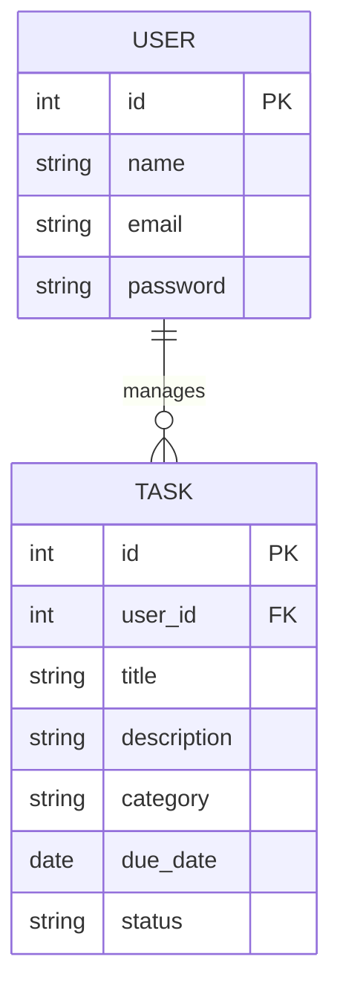
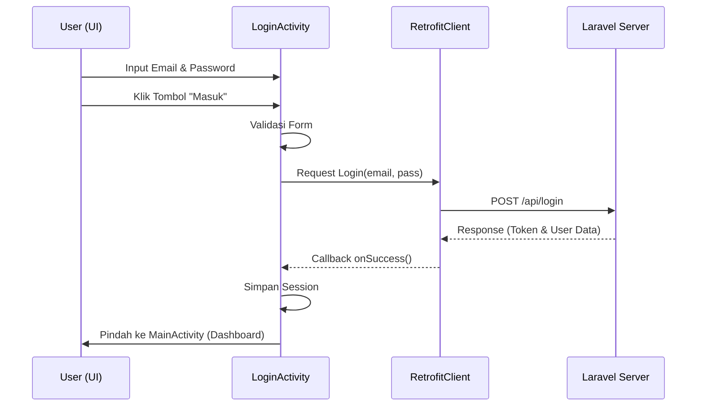
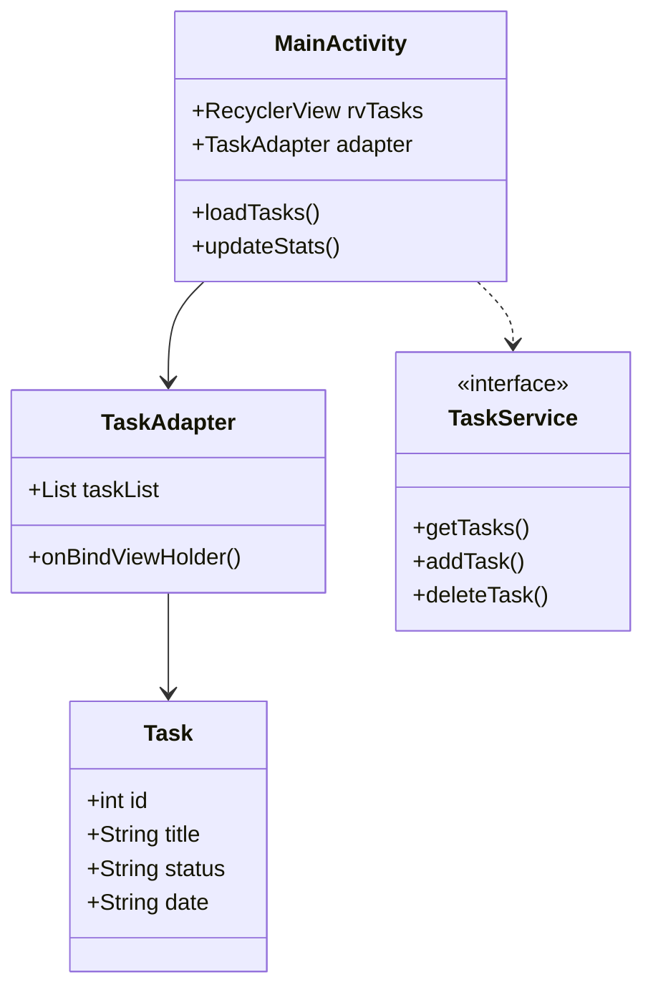
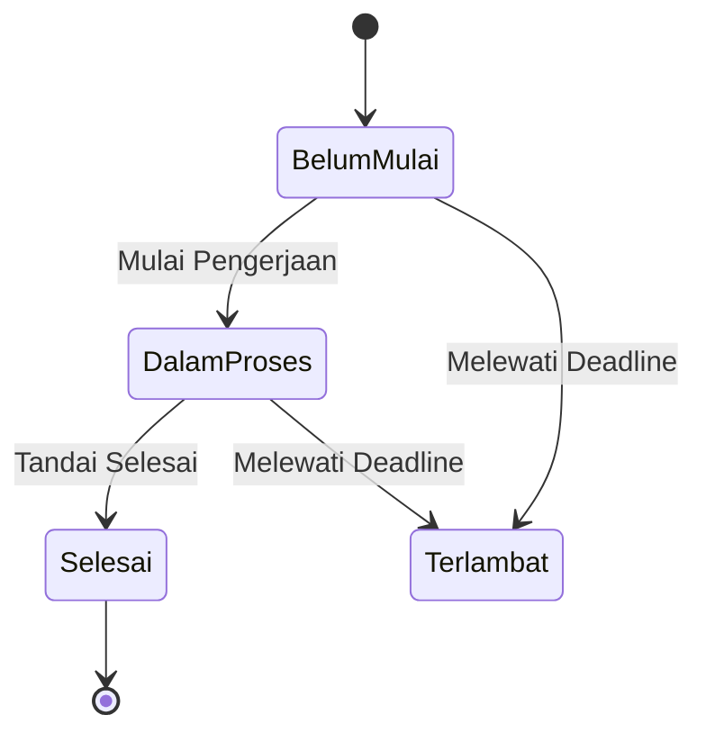

# 📱 Mobile Application — Manajemen Tugas Kuliah (V2.0)

Aplikasi Android modern yang dirancang untuk membantu mahasiswa mengelola daftar tugas kuliah secara efisien. Proyek ini merupakan bagian dari ekosistem **Manajemen Tugas Kuliah** yang terintegrasi dengan backend API Laravel.

---

## 🏗️ System Architecture
Sistem ini menggunakan arsitektur **Client-Server** dengan pola **MVC (Model-View-Controller)** di sisi Android.



---

## 📊 UML Diagrams

### 1. Use Case Diagram
Menunjukkan interaksi antara Mahasiswa sebagai aktor utama dengan fungsionalitas aplikasi.

```mermaid
useCaseDiagram
    actor Mahasiswa
    
    package "Mobile App" {
        usecase "Registrasi Akun" as UC1
        usecase "Login" as UC2
        usecase "Melihat Statistik Dashboard" as UC3
        usecase "Menambah Tugas" as UC4
        usecase "Mengelola Tugas (Edit/Hapus)" as UC5
        usecase "Melihat Daftar Tugas" as UC6
    }
    
    Mahasiswa --> UC1
    Mahasiswa --> UC2
    Mahasiswa --> UC3
    Mahasiswa --> UC4
    Mahasiswa --> UC5
    Mahasiswa --> UC6
```

### 2. Entity Relationship Diagram (ERD)
Representasi data yang dikelola oleh aplikasi (disinkronkan dengan backend).



### 3. Activity Diagram (Proses Tambah Tugas)
Alur kerja pengguna saat menambahkan tugas baru ke dalam sistem.

```mermaid
activityDiagram
    start
    :Buka Halaman Add Task;
    :Input Judul & Mata Kuliah;
    :Pilih Tenggat Waktu;
    if (Input Valid?) then (Ya)
        :Kirim Data ke API (Retrofit);
        if (Respon Sukses?) then (Ya)
            :Tampilkan Toast "Berhasil";
            :Kembali ke Dashboard;
            :Update List & Statistik;
        else (Tidak)
            :Tampilkan Error API;
        fi
    else (Tidak)
        :Tampilkan Error Validasi;
    fi
    stop
```

### 4. Sequence Diagram (Autentikasi Login)
Interaksi antar objek saat proses login berlangsung.



### 5. Class Diagram
Struktur kelas utama dalam aplikasi Android.



### 6. State Diagram (Siklus Hidup Tugas)
Perubahan status sebuah tugas dalam aplikasi.



---

## 🎨 Design UI/UX
Aplikasi ini mengusung tema **iOS-style Ultra Minimalist**:
- **Clean Interface**: Menggunakan latar belakang putih bersih (`#FFFFFF`).
- **Smooth Typography**: Menggunakan hierarki teks yang jelas dan modern.
- **Finger-Friendly**: Tombol dan input field memiliki tinggi yang dioptimalkan (`60dp`) untuk kenyamanan pengguna.
- **Glassmorphism Elements**: Sentuhan efek kaca transparan pada elemen-elemen tertentu untuk estetika premium.

## 🛠️ Tech Stack & Library
- **Core**: Java (Android SDK)
- **UI**: Material Design Components (Material 3)
- **API**: Retrofit 2 & GSON Converter
- **Image**: Glide (rencana)
- **Tooling**: Android Studio Jellyfish

---
**PENGEMBANG**: [Your Name/Team]  
**PROYEK**: UAS Manajemen Tugas Kuliah
