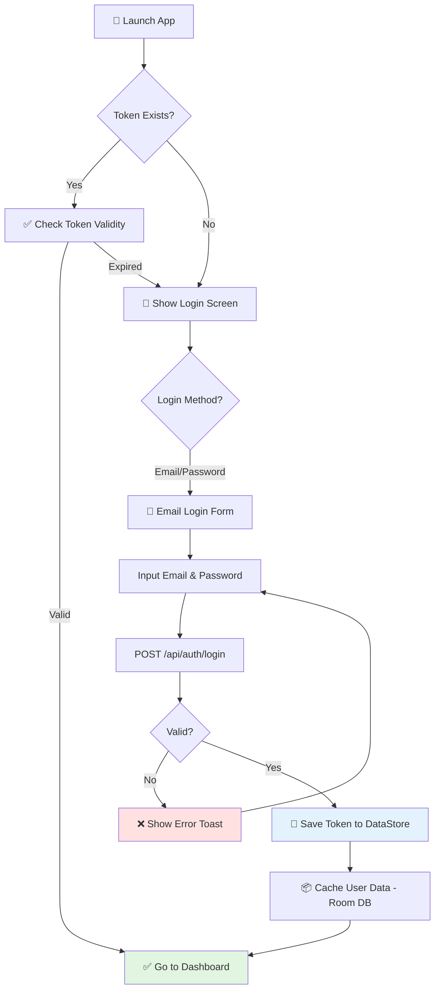
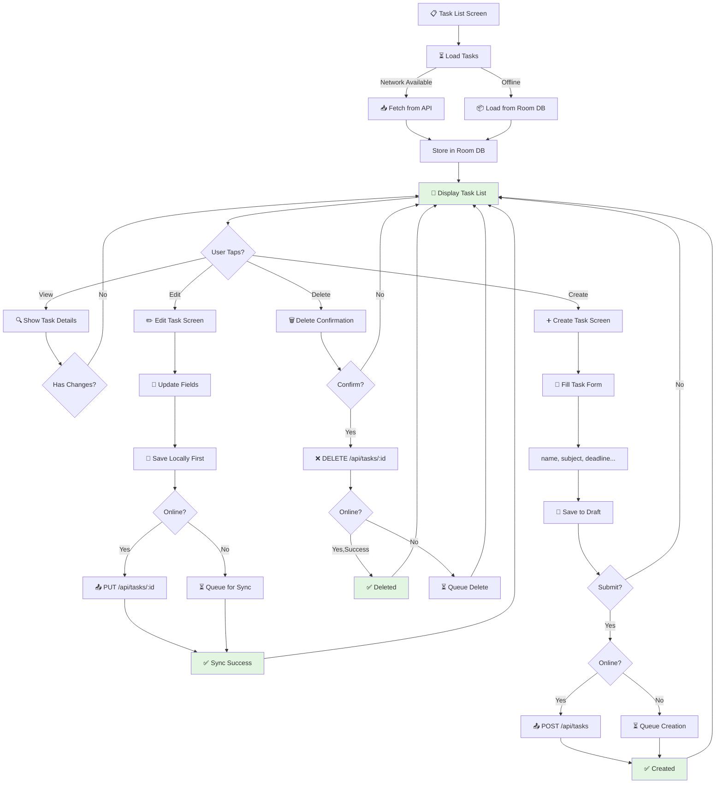
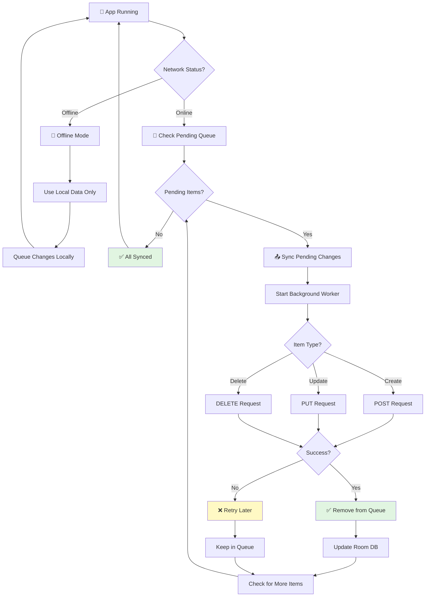
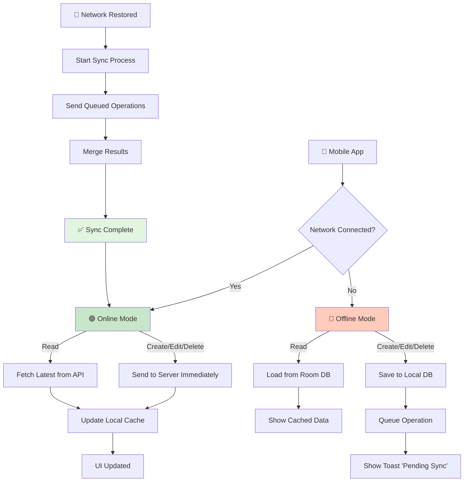
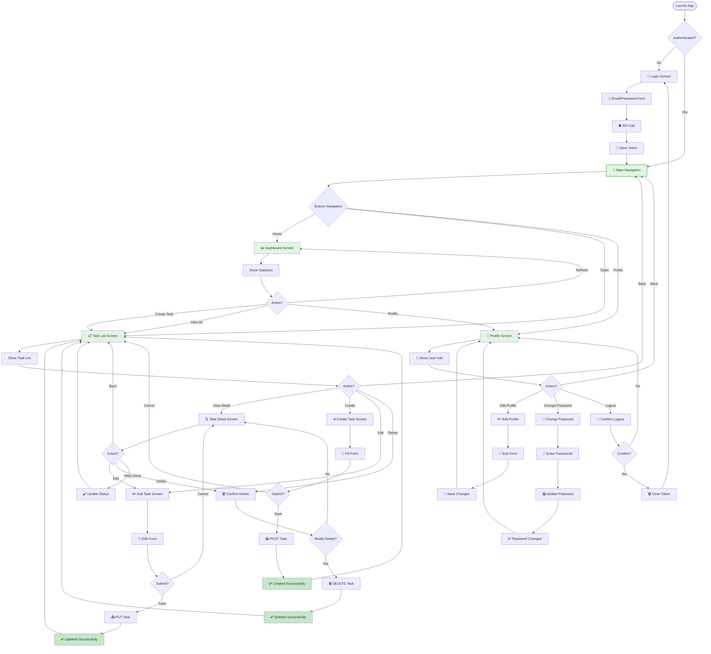

# 📱 Mobile App - Manajemen Tugas Kuliah Android

> Aplikasi Android native untuk manajemen tugas akademik. Dibangun dengan Kotlin dan Jetpack Compose untuk pengalaman pengguna yang modern dan responsif.


---

## 📋 Daftar Isi

- [Deskripsi](#deskripsi)
- [Fitur](#fitur)
- [Mobile App Flowcharts](#mobile-app-flowcharts)
- [Tech Stack](#tech-stack)
- [Struktur Project](#struktur-project)
- [Setup Development](#setup-development)
- [Architecture](#architecture)
- [API Integration](#api-integration)
- [Database (Room)](#database-room)
- [Testing](#testing)
- [Build & Release](#build--release)

---

## 🎯 Deskripsi

**Mobile App** adalah versi Android dari sistem Manajemen Tugas Kuliah, dirancang untuk memberikan akses convenient kepada mahasiswa dalam mengelola tugas akademik mereka kapan saja dan di mana saja.

### Keunggulan Mobile Version:
- 📍 **On-the-Go Access**: Akses tugas dari smartphone
- 🔔 **Push Notifications**: Notifikasi deadline real-time
- 📴 **Offline Mode**: Akses task yang sudah cache
- ⚡ **Fast & Responsive**: Material Design 3 UI
- 🔐 **Secure**: Token-based authentication
- 📱 **Native Performance**: Kotlin + Jetpack best practices

---

## ✨ Fitur

### Authentication
- ✅ Login dengan Email/Password
- ✅ Register akun baru
- ✅ Session management
- ✅ Token-based API authentication (Bearer Token)
- ✅ Logout & Session termination

### Task Management
- ✅ View semua tugas (list view)
- ✅ Create tugas baru
- ✅ Edit tugas existing
- ✅ Delete tugas
- ✅ Mark tugas sebagai complete
- ✅ Filter & sort tugas
- ✅ Search functionality

### Dashboard & Analytics
- ✅ Task statistics (total, in-progress, completed)
- ✅ Priority visualization
- ✅ Deadline countdown
- ✅ Subject categorization

### Notifications
- ✅ Push notification untuk upcoming deadline
- ✅ Local notifications untuk task reminders
- ✅ Customizable notification settings

### UI/UX
- ✅ Material Design 3
- ✅ Light & Dark theme
- ✅ Smooth animations & transitions
- ✅ Responsive layout (phone & tablet)
- ✅ Bottom navigation untuk easy navigation

---

## � Mobile App Flowcharts

### 1. Authentication Flow (Mobile)



### 2. Mobile Task Management Flow



### 3. Background Sync & Notifications



### 4. Offline Mode Strategy



### 5. Complete Mobile Navigation Flow



---

## �🛠 Tech Stack

### Core Technologies
| Component | Library | Version |
|-----------|---------|---------|
| **Language** | Kotlin | 1.9+ |
| **SDK Target** | Android API | 31+ |
| **Min SDK** | Android API | 26+ |
| **UI Framework** | Jetpack Compose | Latest |
| **Build Tool** | Gradle KTS | 8.0+ |

### Architecture & State Management
| Purpose | Library | Usage |
|---------|---------|-------|
| **State Management** | ViewModel + StateFlow | App state & lifecycle |
| **Navigation** | Jetpack Navigation | Screen navigation |
| **Lifecycle** | Lifecycle observables | Activity/Fragment lifecycle |
| **Coroutines** | Kotlin Coroutines | Async operations |

### Networking & Data
| Purpose | Library | Usage |
|---------|---------|-------|
| **HTTP Client** | Retrofit 2 | REST API calls |
| **JSON Parsing** | Moshi/Gson | JSON deserialization |
| **Interceptors** | OkHttp Interceptors | Auth headers & logging |
| **Local DB** | Room Database | Offline data caching |
| **SharedPrefs** | DataStore | User preferences & tokens |

### Testing
| Purpose | Library | Usage |
|---------|---------|-------|
| **Unit Testing** | JUnit 4 | Logic testing |
| **Mocking** | Mockito | Mock objects |
| **Instrumentation** | Espresso | UI testing |
| **Test Helpers** | Turbine | Flow testing |

---

## 📁 Struktur Project

```
mobile/
├── app/
│   ├── src/
│   │   ├── main/
│   │   │   ├── java/com/manajementugas/mobile/
│   │   │   │   ├── MainActivity.kt              # Entry point
│   │   │   │   ├── ui/                         # UI Components & Screens
│   │   │   │   │   ├── screens/
│   │   │   │   │   │   ├── LoginScreen.kt
│   │   │   │   │   │   ├── DashboardScreen.kt
│   │   │   │   │   │   ├── TaskListScreen.kt
│   │   │   │   │   │   ├── TaskDetailScreen.kt
│   │   │   │   │   │   ├── CreateTaskScreen.kt
│   │   │   │   │   │   └── ProfileScreen.kt
│   │   │   │   │   ├── components/              # Reusable components
│   │   │   │   │   │   ├── TaskCard.kt
│   │   │   │   │   │   ├── TopAppBar.kt
│   │   │   │   │   │   └── DialogComponents.kt
│   │   │   │   │   └── theme/
│   │   │   │   │       ├── Color.kt
│   │   │   │   │       ├── Typography.kt
│   │   │   │   │       └── Theme.kt
│   │   │   │   ├── data/                       # Data Layer
│   │   │   │   │   ├── api/
│   │   │   │   │   │   ├── ApiService.kt       # Retrofit service
│   │   │   │   │   │   ├── AuthInterceptor.kt  # Auth header injection
│   │   │   │   │   │   └── ApiClient.kt        # Retrofit setup
│   │   │   │   │   ├── model/
│   │   │   │   │   │   ├── User.kt
│   │   │   │   │   │   ├── Task.kt
│   │   │   │   │   │   ├── LoginRequest.kt
│   │   │   │   │   │   └── ApiResponse.kt
│   │   │   │   │   ├── local/
│   │   │   │   │   │   ├── AppDatabase.kt      # Room database
│   │   │   │   │   │   ├── dao/
│   │   │   │   │   │   │   ├── UserDAO.kt
│   │   │   │   │   │   │   └── TaskDAO.kt
│   │   │   │   │   │   └── entity/
│   │   │   │   │   │       ├── UserEntity.kt
│   │   │   │   │   │       └── TaskEntity.kt
│   │   │   │   │   └── repository/
│   │   │   │   │       ├── AuthRepository.kt   # Auth logic
│   │   │   │   │       ├── TaskRepository.kt   # Task CRUD logic
│   │   │   │   │       └── UserRepository.kt   # User logic
│   │   │   │   ├── viewmodel/                  # ViewModel Layer
│   │   │   │   │   ├── AuthViewModel.kt
│   │   │   │   │   ├── TaskViewModel.kt
│   │   │   │   │   ├── DashboardViewModel.kt
│   │   │   │   │   └── UserViewModel.kt
│   │   │   │   ├── util/                       # Utility functions
│   │   │   │   │   ├── Constants.kt
│   │   │   │   │   ├── PreferenceManager.kt    # SharedPreferences/DataStore
│   │   │   │   │   ├── Extensions.kt
│   │   │   │   │   └── NotificationManager.kt
│   │   │   │   └── di/                         # Dependency Injection (Hilt)
│   │   │   │       ├── AppModule.kt
│   │   │   │       ├── RepositoryModule.kt
│   │   │   │       └── DatabaseModule.kt
│   │   │   ├── res/
│   │   │   │   ├── layout/                     # XML layouts (if needed)
│   │   │   │   ├── drawable/                  # App drawables & assets
│   │   │   │   ├── values/
│   │   │   │   │   ├── strings.xml
│   │   │   │   │   ├── colors.xml
│   │   │   │   │   └── dimens.xml
│   │   │   │   └── mipmap/                     # App icons
│   │   │   ├── AndroidManifest.xml
│   │   │
│   │   ├── test/java/                          # Unit tests
│   │   │   ├── RepositoryTest.kt
│   │   │   ├── ViewModelTest.kt
│   │   │   └── UtilsTest.kt
│   │   │
│   │   └── androidTest/java/                   # Instrumentation tests
│   │       ├── screens/LoginScreenTest.kt
│   │       └── api/ApiTest.kt
│   │
│   └── build.gradle.kts                        # Module build config
│
├── gradle/
│   └── wrapper/
│       ├── gradle-wrapper.jar
│       └── gradle-wrapper.properties
│
├── settings.gradle.kts                         # Gradle settings
├── build.gradle.kts                            # Project build config
├── gradle.properties
├── .gitignore
└── README.md                                   # This file
```

---

## 🚀 Setup Development

### Prerequisites

- **Android Studio** (Flamingo 2022.2.1 atau lebih baru)
- **JDK 17** atau lebih baru
- **Android SDK 31+**
- **Kotlin 1.9+**
- **Gradle 8.0+**

### Installation Steps

#### 1. Clone Repository

```bash
cd manajemen-tugas
git clone https://github.com/damar22004-debug/Projek-Uas---Manajemen-Tugas-Kuliah.git
cd mobile
```

#### 2. Open in Android Studio

```bash
# Option 1: Via Command Line
android-studio .

# Option 2: Manual
# 1. Open Android Studio
# 2. File > Open
# 3. Navigate ke folder 'mobile'
```

#### 3. Configure API Endpoint

Edit `app/src/main/java/com/manajementugas/mobile/util/Constants.kt`:

```kotlin
object Constants {
    const val BASE_URL = "http://192.168.1.100:8000/api/"  // Change to your server IP
    const val TIMEOUT = 30L
    const val DEBUG = true
}
```

#### 4. Build Project

```bash
# Via Android Studio: Build > Make Project (Ctrl+F9)

# Via Gradle:
./gradlew build

# For Debug APK:
./gradlew assembleDebug

# For Release APK:
./gradlew assembleRelease
```

#### 5. Run on Emulator/Device

```bash
# Via Android Studio: Run > Run 'app' (Shift+F10)

# Via Gradle:
./gradlew installDebug

# Check connected devices:
adb devices
```

---

## 🏗️ Architecture

### MVVM Architecture Pattern

```
┌──────────────────────────────────────────────────────┐
│                  UI LAYER                            │
│  (Screens: Login, Dashboard, TaskList, etc)          │
└────────────────────────┬─────────────────────────────┘
                         │ Observes
                         │ StateFlow/LiveData
                         ▼
┌──────────────────────────────────────────────────────┐
│              VIEWMODEL LAYER                         │
│  (State management, business logic)                  │
│  • AuthViewModel                                     │
│  • TaskViewModel                                     │
│  • DashboardViewModel                                │
└────────────────────────┬─────────────────────────────┘
                         │ Uses
                         ▼
┌──────────────────────────────────────────────────────┐
│            REPOSITORY LAYER (Data Access)            │
│  (Abstraction for data sources)                      │
│  • AuthRepository → API + SharedPrefs                │
│  • TaskRepository → API + Room DB                    │
│  • UserRepository → API + Room DB                    │
└────────────────────────┬─────────────────────────────┘
                         │
            ┌────────────┴────────────┐
            ▼                         ▼
    ┌──────────────────┐    ┌────────────────────┐
    │  REMOTE LAYER    │    │  LOCAL LAYER       │
    │  (REST API)      │    │  (Room Database)   │
    │                  │    │                    │
    │ • Retrofit       │    │ • Task Table       │
    │ • OkHttp         │    │ • User Table       │
    │ • Interceptors   │    │ • Cache Table      │
    └──────────────────┘    └────────────────────┘
            │                         │
            ▼                         ▼
    ┌──────────────────┐    ┌────────────────────┐
    │  Web Server      │    │  Local SQLite DB   │
    │  (Laravel API)   │    │  (On Device)       │
    └──────────────────┘    └────────────────────┘
```

### Data Flow Example: Login Process

```
User Input (Email, Password)
        │
        ▼
┌─────────────────┐
│  LoginScreen    │ ← User enters credentials
└────────┬────────┘
         │ Calls
         ▼
┌──────────────────────┐
│  AuthViewModel       │
│  .login()            │ ← Business logic
└────────┬─────────────┘
         │ Calls
         ▼
┌──────────────────────┐
│  AuthRepository      │
│  .login()            │ ← API call + caching
└────────┬─────────────┘
         │
    ┌────┴────┐
    ▼         ▼
  API       SharedPrefs
  │         │
  │         └─→ Store JWT Token
  │
  └─→ GET /api/auth/login
      Request: {email, password}
      Response: {user, token}
        │
        ├─→ Update ViewModel State
        │   ├─ isLoading = false
        │   ├─ user = User object
        │   └─ token = JWT token
        │
        └─→ Navigate to Dashboard
```

---

## 🔌 API Integration

### Retrofit Setup

**app/src/main/java/com/manajementugas/mobile/data/api/ApiClient.kt**

```kotlin
object ApiClient {
    private val okHttpClient = OkHttpClient.Builder()
        .addInterceptor(AuthInterceptor())
        .connectTimeout(Constants.TIMEOUT, TimeUnit.SECONDS)
        .readTimeout(Constants.TIMEOUT, TimeUnit.SECONDS)
        .build()

    val retrofit: Retrofit = Retrofit.Builder()
        .baseUrl(Constants.BASE_URL)
        .client(okHttpClient)
        .addConverterFactory(MoshiConverterFactory.create())
        .build()

    val apiService: ApiService = retrofit.create(ApiService::class.java)
}
```

### API Service Interface

**app/src/main/java/com/manajementugas/mobile/data/api/ApiService.kt**

```kotlin
interface ApiService {
    // Auth endpoints
    @POST("auth/login")
    suspend fun login(@Body request: LoginRequest): ApiResponse<AuthResponse>

    @POST("auth/register")
    suspend fun register(@Body request: RegisterRequest): ApiResponse<AuthResponse>

    @POST("auth/logout")
    suspend fun logout(): ApiResponse<Unit>

    // Task endpoints
    @GET("tasks")
    suspend fun getTasks(): ApiResponse<List<Task>>

    @GET("tasks/{id}")
    suspend fun getTask(@Path("id") id: Int): ApiResponse<Task>

    @POST("tasks")
    suspend fun createTask(@Body task: CreateTaskRequest): ApiResponse<Task>

    @PUT("tasks/{id}")
    suspend fun updateTask(@Path("id") id: Int, @Body task: UpdateTaskRequest): ApiResponse<Task>

    @DELETE("tasks/{id}")
    suspend fun deleteTask(@Path("id") id: Int): ApiResponse<Unit>

    // User endpoints
    @GET("user")
    suspend fun getProfile(): ApiResponse<User>

    @PUT("user/profile")
    suspend fun updateProfile(@Body data: UpdateProfileRequest): ApiResponse<User>
}
```

### Auth Interceptor

**app/src/main/java/com/manajementugas/mobile/data/api/AuthInterceptor.kt**

```kotlin
class AuthInterceptor @Inject constructor(
    private val preferenceManager: PreferenceManager
) : Interceptor {
    override fun intercept(chain: Interceptor.Chain): Response {
        val token = preferenceManager.getToken()
        val request = chain.request().newBuilder()
            .apply {
                if (!token.isNullOrEmpty()) {
                    addHeader("Authorization", "Bearer $token")
                }
                addHeader("Accept", "application/json")
            }
            .build()
        return chain.proceed(request)
    }
}
```

---

## 💾 Database (Room)

### Database Setup

**app/src/main/java/com/manajementugas/mobile/data/local/AppDatabase.kt**

```kotlin
@Database(
    entities = [
        UserEntity::class,
        TaskEntity::class
    ],
    version = 1,
    exportSchema = false
)
abstract class AppDatabase : RoomDatabase() {
    abstract fun userDao(): UserDAO
    abstract fun taskDao(): TaskDAO

    companion object {
        @Volatile
        private var INSTANCE: AppDatabase? = null

        fun getDatabase(context: Context): AppDatabase {
            return INSTANCE ?: synchronized(this) {
                Room.databaseBuilder(
                    context,
                    AppDatabase::class.java,
                    "manajemen_tugas_db"
                ).build().also { INSTANCE = it }
            }
        }
    }
}
```

### Entity Models

**UserEntity.kt & TaskEntity.kt**

```kotlin
@Entity(tableName = "users")
data class UserEntity(
    @PrimaryKey
    val id: Int,
    val name: String,
    val email: String,
    @ColumnInfo(name = "created_at")
    val createdAt: String
)

@Entity(
    tableName = "tasks",
    foreignKeys = [
        ForeignKey(
            entity = UserEntity::class,
            parentColumns = ["id"],
            childColumns = ["user_id"],
            onDelete = ForeignKey.CASCADE
        )
    ]
)
data class TaskEntity(
    @PrimaryKey
    val id: Int,
    @ColumnInfo(name = "user_id")
    val userId: Int,
    val name: String,
    val subject: String,
    val description: String,
    val status: String,  // "Belum Mulai", "Proses", "Selesai"
    val priority: String, // "Low", "Medium", "High", "Urgent"
    val deadline: String,
    @ColumnInfo(name = "created_at")
    val createdAt: String,
    @ColumnInfo(name = "updated_at")
    val updatedAt: String
)
```

### DAO (Data Access Objects)

```kotlin
@Dao
interface TaskDAO {
    @Query("SELECT * FROM tasks WHERE user_id = :userId")
    suspend fun getAllTasks(userId: Int): List<TaskEntity>

    @Query("SELECT * FROM tasks WHERE id = :taskId")
    suspend fun getTask(taskId: Int): TaskEntity

    @Insert(onConflict = OnConflictStrategy.REPLACE)
    suspend fun insertTask(task: TaskEntity)

    @Update
    suspend fun updateTask(task: TaskEntity)

    @Delete
    suspend fun deleteTask(task: TaskEntity)

    @Query("DELETE FROM tasks WHERE id = :taskId")
    suspend fun deleteTaskById(taskId: Int)
}
```

---

## 🧪 Testing

### Unit Tests

**Test DAO operations:**

```bash
./gradlew test
```

**Example test:**

```kotlin
@RunWith(AndroidJUnit4::class)
class TaskDAOTest {
    @get:Rule
    val instantExecutorRule = InstantTaskExecutorRule()

    private lateinit var database: AppDatabase
    private lateinit var taskDAO: TaskDAO

    @Before
    fun setUp() {
        database = Room.inMemoryDatabaseBuilder(
            ApplicationProvider.getApplicationContext(),
            AppDatabase::class.java
        ).build()
        taskDAO = database.taskDAO()
    }

    @After
    fun tearDown() {
        database.close()
    }

    @Test
    suspend fun insertAndGetTask() = runTest {
        val task = TaskEntity(
            id = 1,
            userId = 1,
            name = "Test Task",
            subject = "Testing",
            status = "Belum Mulai",
            priority = "High",
            deadline = "2026-03-01",
            description = "Test",
            createdAt = "",
            updatedAt = ""
        )

        taskDAO.insertTask(task)
        val retrieved = taskDAO.getTask(1)

        assertEquals(task.id, retrieved.id)
        assertEquals(task.name, retrieved.name)
    }
}
```

### UI Tests (Espresso)

```bash
./gradlew connectedAndroidTest
```

---

## 📦 Build & Release

### Debug Build

```bash
./gradlew assembleDebug
# APK will be at: app/build/outputs/apk/debug/app-debug.apk
```

### Release Build

```bash
# 1. Configure signing in build.gradle.kts
# 2. Build release APK
./gradlew assembleRelease

# 3. APK at: app/build/outputs/apk/release/app-release.apk
```

### ProGuard/R8 Configuration

**app/proguard-rules.pro**

```proguard
# Keep model classes
-keep class com.manajementugas.mobile.data.model.** { *; }

# Keep API service
-keep interface com.manajementugas.mobile.data.api.** { *; }

# Retrofit
-keep class retrofit2.** { *; }
-keepclasseswithmembers class retrofit2.** { *; }
```

---

## 🔄 Continuous Integration

### GitHub Actions Workflow

**.github/workflows/android-ci.yml**

```yaml
name: Android CI

on:
  push:
    branches: [ main, develop ]
  pull_request:
    branches: [ main, develop ]

jobs:
  build:
    runs-on: ubuntu-latest
    steps:
      - uses: actions/checkout@v3
      - name: set up JDK 17
        uses: actions/setup-java@v3
        with:
          java-version: '17'
          distribution: 'temurin'
      - name: Build with Gradle
        run: cd mobile && ./gradlew build
```

---

## 📞 Support & Kontribusi

- **GitHub**: [damar22004-debug](https://github.com/damar22004-debug)
- **Issues**: [Report Bugs](https://github.com/damar22004-debug/Projek-Uas---Manajemen-Tugas-Kuliah/issues)

---

**Created with ❤️ for college students managing their academic tasks efficiently**

Last Updated: 23 Februari 2026
