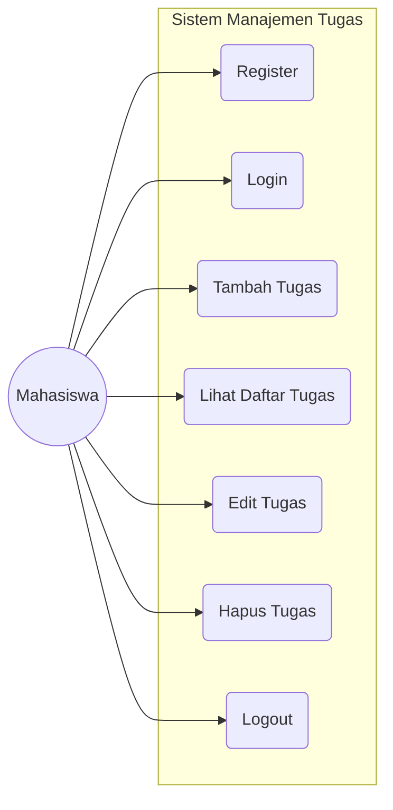

# Mobile Application — Manajemen Tugas Kuliah (V2.0)

Aplikasi Android modern untuk membantu mahasiswa mengelola daftar tugas kuliah secara efisien. Proyek ini merupakan bagian dari "Projek UAS - Manajemen Tugas Kuliah" dan berfungsi sebagai klien mobile yang terhubung ke backend API dengan antarmuka yang selaras dengan versi Web Dashboard.

## 🚀 Fitur Utama
- **Autentikasi Pengguna**: Sistem Registrasi dan Login (System Login V2.0).
- **Dashboard Statistik**: Pantau progres tugas dengan kartu statistik (Total, Belum Mulai, Selesai, dsb).
- **Manajemen Tugas (CRUD)**:
    - **Tambah Tugas**: Menambahkan nama, mata kuliah, dan tenggat waktu.
    - **Lihat Daftar**: Menampilkan daftar tugas dengan kartu modern (Glassmorphism style).
    - **Aksi Cepat**: Edit dan Hapus langsung dari daftar utama.
- **Antarmuka Modern**: Desain berbasis Material Design dengan gradien lembut dan kartu membulat.

## 🛠️ Tech Stack
- **Bahasa**: Java
- **Networking**: Retrofit 2 & GSON (REST API)
- **UI Framework**: Android Material Design (Material 3)
- **Architecture**: Model-View-Controller (MVC)
- **Design Style**: Glassmorphism & Card-based Layout

## 📊 Use Case Diagram


## 📂 Struktur Proyek
```text
mobile/
├── app/
│   ├── src/main/java/com/example/projekappmanajementugaskuliah/
│   │   ├── LoginActivity.java       # Login modern dengan progress bar
│   │   ├── RegisterActivity.java    # Registrasi akun baru
│   │   ├── MainActivity.java        # Dashboard & Statistik
│   │   ├── AddTaskActivity.java     # Form tambah tugas modern
│   │   ├── Task.java                # Model data tugas
│   │   ├── TaskAdapter.java         # Adapter kartu tugas
│   │   ├── TaskService.java         # Interface Retrofit (API)
│   │   └── RetrofitClient.java      # Client API (Base URL)
│   ├── src/main/res/layout/         # File desain XML (Modern Layouts)
│   └── src/main/res/drawable/       # Aset grafis (Gradients & Shapes)
└── build.gradle.kts                 # Dependensi & Config
```

## ⚙️ Cara Menjalankan (Lokal)
1. **Prasyarat**:
    - Install [Android Studio](https://developer.android.com/studio).
    - Pastikan backend API sudah berjalan (XAMPP/Laravel).
2. **Clone & Open**:
    - Clone repository ini dan buka folder `mobile`.
3. **Konfigurasi API**:
    - Buka `RetrofitClient.java`.
    - Ubah `BASE_URL` ke alamat IP lokal Anda (Gunakan `10.0.2.2` jika menggunakan emulator).
4. **Build & Run**:
    - Tekan `Run` di Android Studio atau jalankan:
      ```bash
      ./gradlew installDebug
      ```

## 🔗 Endpoints API
- `POST /login` - Autentikasi user.
- `POST /register` - Pendaftaran user.
- `GET /tasks` - Ambil daftar tugas.
- `POST /tasks` - Simpan tugas baru.

---
**Catatan**: Tampilan mobile telah disesuaikan agar memiliki identitas visual yang sama dengan versi Web Dashboard (Tema Biru Muda & Glassmorphism).
